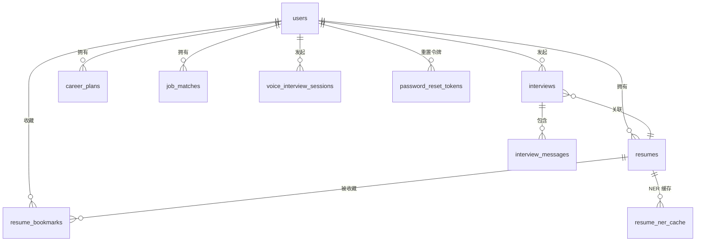
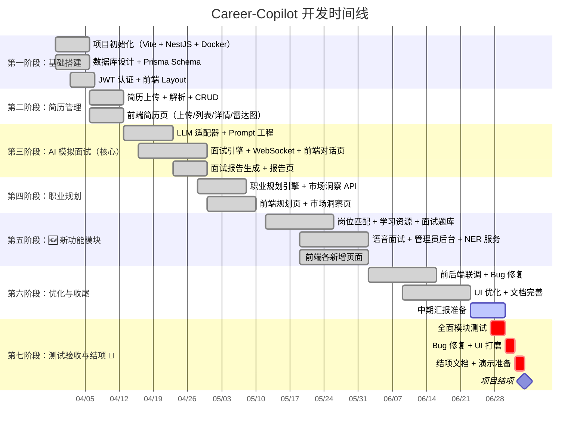

# Career-Copilot 中期汇报文档

> **项目名称**：AI 模拟面试官 + 智能职业规划平台（Career-Copilot）
> **汇报日期**：2026-06-28
> **版本**：v1.2
> **文档状态**：✅ 已完成（含最新功能更新）

---

## 目录

1. [项目概述](#一项目概述)
2. [团队组成与分工](#二团队组成与分工)
3. [技术架构](#三技术架构)
4. [开发进展总览](#四开发进展总览)
5. [后端模块实现详情](#五后端模块实现详情)
6. [前端页面实现详情](#六前端页面实现详情)
7. [数据库设计](#七数据库设计)
8. [AI 与数据资产](#八ai-与数据资产)
9. [开发时间线](#九开发时间线)
10. [测试方案](#十测试方案)
11. [遇到的挑战与解决方案](#十一遇到的挑战与解决方案)
12. [后续计划](#十二后续计划)

---

## 一、项目概述

### 1.1 项目背景与意义

**求职困境的现实痛点：** 当前大学生就业市场竞争日趋激烈。据教育部数据，2026 届高校毕业生人数再创新高，而大多数学生在校期间缺乏真实的面试训练机会。传统求职辅导存在以下突出问题：

- **零面试经验**：多数学生在正式求职前从未经历过完整的面试流程，面对面试官时紧张无措
- **简历石沉大海**：缺乏对岗位 JD 的理解，简历与岗位匹配度低，海投却鲜有回音
- **职业方向迷茫**：不清楚目标岗位需要哪些技能，缺乏系统性的学习和准备规划
- **反馈严重缺失**：面试失败后往往只得到一个结果，缺少具体维度的改进建议
- **辅导成本高昂**：一对一的职业咨询和模拟面试价格昂贵，学生难以负担

**项目愿景：** 打造一款**AI 驱动的智能求职面试与职业规划助手**，让每一位大学生都能低成本、高频次地进行面试模拟，获得专业级的简历评估、岗位匹配和职业发展建议，从根本上缓解求职焦虑，提升就业竞争力。

**项目时间线：** 项目自 2026 年 6 月 12 日正式启动，计划于 **2026 年 7 月 4 日** 前完成全部功能开发、测试验收与结项工作。

### 1.2 核心功能

|      功能模块       | 核心能力                                                           | 优先级 |   实现情况   |
| :-----------------: | ------------------------------------------------------------------ | :----: | :----------: |
| 🤖 **AI 模拟面试**  | 数字人面试官根据目标岗位自动出题，支持追问 + 评分 + 流式对话       |   P0   | ✅  |
| 📄 **简历智能解析** | 上传 PDF/Word，AI 自动提取技能树、工作经历、教育背景，一键关联面试 |   P0   | ✅ |
| 📊 **多维面试报告** | 专业技术、沟通表达、逻辑思维、项目经验等多维度评估                 |   P0   | ✅  |
|   🎯 **职业规划**   | 技能差距分析 + 分阶段学习路线 + 市场洞察，告别迷茫                 |   P1   | ✅ |
|    **岗位匹配**     | 简历与岗位 JD 智能匹配，推荐适合职位                               |   P1   | ✅ ⏳ 待测试 |
|    **面试题库**     | 按岗位、难度筛选的独立面试题练习                                   |   P1   | ✅ ⏳ 待测试 |
|    **语音面试**     | 支持语音交互的模拟面试（ASR/TTS）                                  |   P1   | ✅ ⏳ 待测试 |
|  **学习资源推荐**   | 根据技能差距推荐课程/文章/项目                                     |   P1   | ✅ ⏳ 待测试 |
|   **管理员后台**    | 用户管理、系统统计、日志审计                                       |   P1   | ✅ ⏳ 待测试 |
|    **简历 NER**     | 基于 BIO 标注的中文简历命名实体识别                                |   P1   | ✅ ⏳ 待测试 |

### 1.3 技术亮点

| 亮点                   | 说明                                                                 |
| :--------------------- | :------------------------------------------------------------------- |
| **多模型 LLM 适配**    | 抽象工厂模式支持 DeepSeek / OpenAI / 通义千问一键切换                |
| **WebSocket 流式对话** | 面试对话实时流式输出，前端打字机动画效果                             |
| **AI + 规则双引擎**    | 简历解析 LLM 为主 + OCR 扫描件回退，中文 NER 结合 BIO 标注和词典规则 |
| **异步任务队列**       | BullMQ 处理简历解析和面试报告生成，避免阻塞 API 响应                 |
| **双 Token 认证**      | JWT Access + Refresh Token，Redis 黑名单机制保障安全                 |

### 1.4 目标用户

|      用户画像       | 核心需求                   |
| :-----------------: | -------------------------- |
|  🎓 迷茫的大三学生  | 了解岗位要求、积累面试经验 |
| 🏃 冲刺的应届毕业生 | 高强度面试训练、针对性改进 |
|   🔄 跨专业求职者   | 技能差距分析、学习路径规划 |
|    💼 职场跳槽者    | 高阶面试模拟、市场行情参考 |
|  ❓ 职业迷茫期用户  | 职业探索、个性化推荐       |

---

## 二、团队组成与分工

### 2.1 成员信息

|       角色        |    姓名    | 专业班级  |                   GitHub                    | 主要职责                                                                                                                                            |
| :---------------: | :--------: | :-------: | :-----------------------------------------: | --------------------------------------------------------------------------------------------------------------------------------------------------- |
| 👑 **项目负责人** | **陶宏阳** | 软件 2402 | [peeker-tao](https://github.com/peeker-tao) | 项目架构设计、AI 核心逻辑（LLM Prompt + 面试引擎）、后端核心模块（面试 + WebSocket + 语音面试 + 面试题库）、Python NER 服务搭建、代码审查与进度把控 |
|  🖥 **前端开发**  | **邓继舟** | 软件 2402 |  [hezhui845](https://github.com/hezhui845)  | 前端开发（面试对话页、简历管理页、数字人组件、登录/注册页、面试题库页、语音面试页、简历 NER 展示）                                                  |
|  🖥 **前端开发**  |  **李烨**  | 软件 2402 |  [lyxyz5223](https://github.com/lyxyz5223)  | 前端开发（职业规划页、仪表盘首页、个人中心页、岗位匹配页、学习资源页、管理员后台页、公共组件如 Layout）                                             |
|  ⚙️ **后端开发**  | **赵原一** | 软件 2402 |  [sixteen06](https://github.com/sixteen06)  | 数据库设计 + Prisma Schema、用户/认证模块、简历模块（上传 + 解析 API）、职业规划模块 API、岗位匹配 + 学习资源 + 管理员后端、Docker 部署             |

### 2.2 分工策略

```
项目分为 4 条主线 + 1 个协调角色：

陶宏阳（架构+AI+协调）
  ├─ 项目架构设计
  ├─ AI 核心逻辑（LLM Prompt + 面试引擎）
  ├─ 后端核心模块（面试 + WebSocket + 语音面试 + 题库）
  └─ 代码审查 + 进度把控

邓继舟（前端主线）           李烨（前端辅线）
  ├─ 面试对话页               ├─ 职业规划页
  ├─ 简历管理页               ├─ 仪表盘首页
  ├─ 数字人组件               ├─ 个人中心页
  ├─ 登录/注册页              └─ 公共组件（Layout等）
  ├─ 面试题库页
  └─ 语音面试页

赵原一（后端主线）
  ├─ 数据库设计 + Prisma Schema
  ├─ 用户/认证模块
  ├─ 简历模块（上传 + 解析 API）
  ├─ 职业规划模块 API
  ├─ 岗位匹配 + 学习资源 + 管理员后端
  └─ Docker 部署
```

---

## 三、技术架构

### 3.1 技术栈总览

|     层次      | 技术选型                      |    版本    | 用途                              |
| :-----------: | ----------------------------- | :--------: | --------------------------------- |
| **前端框架**  | React + TypeScript            | 19.x / 6.x | 组件化 UI 开发                    |
| **前端构建**  | Vite                          |    8.x     | 极速 HMR，开发体验好              |
| **UI 组件库** | Ant Design                    |    5.x     | 企业级表单/表格/弹窗              |
| **状态管理**  | Zustand                       |    5.x     | 轻量级 TS 友好状态管理            |
|   **路由**    | React Router                  |     v7     | SPA 路由管理                      |
|   **图表**    | ECharts                       |    6.x     | 技能雷达图、市场数据可视化        |
| **后端框架**  | NestJS                        |    11.x    | 模块化架构、TS 原生支持           |
|  **数据库**   | PostgreSQL                    |    15+     | 关系型数据持久化                  |
|    **ORM**    | Prisma                        |    5.x     | TS 优先类型安全 ORM               |
|   **缓存**    | Redis                         |     7+     | 会话缓存、Token 存储              |
| **消息队列**  | BullMQ                        |    5.x     | 基于 Redis 的异步任务（简历解析） |
|  **AI/LLM**   | DeepSeek / OpenAI / 通义千问  |     —      | 面试题生成、追问、反馈、简历解析  |
| **实时通信**  | Socket.IO                     |    4.x     | 面试 WebSocket 实时对话           |
|   **认证**    | JWT（Access + Refresh Token） |     —      | 用户鉴权                          |
|  **容器化**   | Docker Compose                |     —      | 一键部署                          |

### 3.2 系统架构图

```
┌───────────────────────────────────────────────────────────────────┐
│                       Frontend (React + Vite)                     │
│  ┌──────────┐ ┌──────────┐ ┌──────────┐ ┌──────────┐ ┌────────┐ │
│  │ 用户页面  │ │ 面试模拟  │ │ 职业规划  │ │ 简历管理  │ │ 岗位匹配│ │
│  │ (登录/    │ │ (数字人   │ │ (路径     │ │ (上传/    │ │ (推荐/  │ │
│  │  注册)    │ │  对话)   │ │  推荐)   │ │  解析)   │ │ 分析)  │ │
│  └──────────┘ └──────────┘ └──────────┘ └──────────┘ └────────┘ │
│  ┌──────────┐ ┌──────────┐ ┌──────────┐ ┌────────────────────┐  │
│  │ 学习资源  │ │ 面试题库  │ │ 语音面试  │ │ 管理员后台        │  │
│  └──────────┘ └──────────┘ └──────────┘ └────────────────────┘  │
└──────────────────────┬───────────────────────────────────────────┘
                       │ HTTP / WebSocket
┌──────────────────────▼───────────────────────────────────────────┐
│                     API Gateway (NestJS)                          │
│  ┌──────────┐ ┌──────────┐ ┌──────────┐ ┌──────────┐ ┌────────┐ │
│  │ Auth     │ │ Interview│ │ Career   │ │ Resume   │ │ Admin  │ │
│  │ Module   │ │ Module   │ │ Module   │ │ Module   │ │ Module │ │
│  ├──────────┤ ├──────────┤ ├──────────┤ ├──────────┤ ├────────┤ │
│  │JobMatch  │ │ Learning │ │Question  │ │Voice     │ │Resume  │ │
│  │ Module   │ │ Resources│ │ Bank     │ │Interview │ │NER(svc)│ │
│  └──────────┘ └──────────┘ └──────────┘ └──────────┘ └────────┘ │
└──────┬──────────────┬──────────────┬─────────────────────────────┘
       │              │              │
┌──────▼──────┐ ┌─────▼──────┐ ┌────▼──────────────────┐
│ PostgreSQL  │ │   Redis    │ │  AI Services           │
│ (10 个模型)  │ │ (会话缓存/ │ │  ├─ LLM (面试生成)     │
│             │ │  消息队列) │ │  ├─ 语音识别 (ASR)     │
│             │ │            │ │  ├─ 语音合成 (TTS)     │
└─────────────┘ └────────────┘ │  └─ NER 实体识别       │
                               └────────────────────────┘
```

### 3.3 后端项目结构

```
backend/
├── prisma/
│   └── schema.prisma              # 10 个数据库模型
├── scripts/
│   ├── init.sql                   # DDL 建表脚本
│   └── seed.sql                   # 种子数据
├── src/
│   ├── auth/                      # 认证模块（12 文件）
│   ├── user/                      # 用户模块（3 文件）
│   ├── resume/                    # 简历模块（5 文件）
│   ├── resume-ner/                # NER 模块（2 文件）
│   ├── interview/                 # 面试模块（8 文件）
│   ├── career/                    # 职业规划（6 文件）
│   ├── ai/                        # AI 服务层（6 文件 + 5 prompts）
│   ├── job-matching/              # 🆕 岗位匹配（3 文件）
│   ├── learning-resources/        # 🆕 学习资源（4 文件）
│   ├── question-bank/             # 🆕 面试题库（4 文件）
│   ├── voice-interview/           # 🆕 语音面试（4 文件）
│   ├── admin/                     # 🆕 管理员后台（4 文件）
│   ├── common/                    # 公共模块（过滤器/守卫/管道）
│   ├── queue/                     # 消息队列
│   ├── redis/                     # Redis 服务
│   └── types/                     # 类型定义
├── uploads/resumes/               # 简历文件存储
└── 后端测试说明/                   # 测试文档（6 个模块）
```

### 3.4 前端项目结构

```
frontend/
├── src/
│   ├── api/                       # API 接口封装（10 文件）
│   ├── components/                # 组件库（50+ 组件）
│   │   ├── common/                # 通用组件（Loading/ErrorBoundary/Toast 等）
│   │   ├── layout/                # 布局组件（AppLayout/Sidebar/Header）
│   │   ├── home/                  # 首页组件
│   │   ├── resume/                # 简历组件
│   │   ├── interview/             # 面试组件
│   │   ├── career-plan/           # 职业规划组件
│   │   └── user/                  # 用户组件
│   ├── hooks/                     # 自定义 Hooks（useAuth/useWebSocket 等）
│   ├── pages/                     # 页面（12 个路由页面）
│   ├── store/                     # Zustand 状态管理（5 store）
│   └── styles/                    # 全局样式
```

---

## 四、开发进展总览

### 4.1 总体进度

| 维度               |                完成情况                |
| :----------------- | :------------------------------------: |
| **后端模块**       |  16/16 模块实现 ✅ **100%** ⏳ 待测试  |
| **后端 API 任务**  | 27/27 项完成 ✅ **100%** ⏳ 部分待测试 |
| **数据库模型**     |       10/10 模型定义 ✅ **100%**       |
| **前端页面**       |  12/12 路由页面 ✅ **100%** ⏳ 待测试  |
| **前端组件**       |     50+ 组件 ✅ **100%** ⏳ 待测试     |
| **AI Prompt 工程** | 5 套 Prompt 模板 ✅ **100%** ⏳ 待测试 |
| **数据集**         |      4 个数据集已下载 ✅ **100%**      |
| **测试文档**       |      6 个模块测试说明 ✅ **100%**      |
| **Docker 部署**    |         PostgreSQL + Redis ✅          |
| **端到端测试**     |      ⏳ 待执行（计划 7/4 前完成）      |

### 4.2 Git 提交统计

项目采用 **多分支协作模式**，共有 **3 个活跃分支**（`backend`、`frontend`、`main`），累计 **30+ 次提交**，由 **3 名成员**在约 **2 周**（2026-06-12 至 2026-06-26）内完成密集开发。

| 指标       |                    数值                     |
| :--------- | :-----------------------------------------: |
| 总提交次数 |                 **30+ 次**                  |
| 分支数     |         3（backend / frontend / main）       |
| 参与成员   |      3 人（peekertao / sixteen06 / lyxyz5223）      |
| 开发周期   |           约 2 周（6/12 — 6/26）            |
| 代码风格   | Conventional Commits（feat/fix/docs/chore） |

**关键提交记录（`main`，HEAD：5fe17ed）：**

| 日期  | 提交者 | 提交信息                                                    | 说明                                    |
| :---: | :----: | ----------------------------------------------------------- | --------------------------------------- |
| 06-26 |  李烨  | `fix: fix dashboard data calculation error`                 | 修复仪表盘数据计算错误                  |
| 06-26 | 赵原一 | `修复面试计数不一致bug`                                     | 面试统计计数 Bug 修复                   |
| 06-25 | 赵原一 | `添加会议删除接口实现`                                      | 会议管理 DELETE 端点                    |
| 06-24 | 赵原一 | `实现dashboard和update-progress模块`                        | 仪表盘统计 + 学习进度更新               |
| 06-23 | 赵原一 | `add redis service and module configuration`                | Redis 服务模块（缓存/会话/黑名单/限流） |
| 06-23 | 陶宏阳 | `添加统一异常过滤、修改小bug`                               | 全局异常过滤器                          |
| 06-18 | 陶宏阳 | `修改一些bug,加入快速开始文档`                              | Bug 修复 + 快速开始文档                 |
| 06-17 | 陶宏阳 | `实现了Prisma Schema设计与迁移...等20项基础功能`            | Schema + Auth + CRUD + LLM + Queue + Redis |
| 06-17 |  李烨  | `feat: add reusable common components and interview history page` | 通用组件 + 面试历史页              |
| 06-17 |  李烨  | `feat: add resume management pages (list, upload, detail)`  | 简历管理三页面                          |
| 06-16 |  李烨  | `feat: add dashboard, career plan, profile and interview pages` | 仪表盘 + 职业规划 + 个人中心 + 面试页 |
| 06-13 | 陶宏阳 | `项目架构与分工设计`                                        | 项目架构文档与分工方案                  |
| 06-12 | 陶宏阳 | `初始提交`                                                  | 仓库初始化                              |

> **说明**：前端代码由李烨（lyxyz5223）主笔提交，邓继舟（hezhui845）参与协作开发；后端代码由陶宏阳（peekertao）和赵原一（sixteen06）共同提交。项目规划阶段始于 2026-03-30，代码密集开发期为 6/12—6/26。

---

## 五、后端模块实现详情

### 5.1 模块清单

|           模块            | 文件数 | Controller | Service | 关键特性                                                                                               |         状态          |
| :-----------------------: | :----: | :--------: | :-----: | ------------------------------------------------------------------------------------------------------ | :-------------------: |
|       **auth** 认证       |   12   |     ✅     |   ✅    | JWT 双 Token（Access + Refresh）、Passport 策略、角色守卫、注册/登录/刷新/密码重置                     |       ✅ 已实现       |
|       **user** 用户       |   3    |     ✅     |   ✅    | 个人资料 CRUD、用户列表、教育背景/目标岗位管理                                                         |       ✅ 已实现       |
|      **resume** 简历      |   5    |     ✅     |   ✅    | 上传（Multer）、LLM 解析（pdf-parse + mammoth）、OCR 回退（tesseract.js）、六维评分、Bull 队列异步处理 |       ✅ 已实现       |
|    **interview** 面试     |   8    |     ✅     |   ✅    | WebSocket 实时通信、流式输出（ai_message_chunk）、AI 追问/反馈、面试报告生成、多轮对话管理             |       ✅ 已实现       |
|    **career** 职业规划    |   6    |     ✅     |   ✅    | 技能差距分析、分阶段学习路线生成、市场洞察（薪资/技能排行）                                            |       ✅ 已实现       |
|      **ai** AI 服务       |   6    |     ✅     |   ✅    | LLM Provider 抽象层（DeepSeek/OpenAI/通义千问）、5 套 Prompt 模板、统一调用入口                        |       ✅ 已实现       |
|    **job-matching** 🆕    |   3    |     ✅     |   ✅    | JD 分析、简历-岗位技能匹配、匹配度计算、岗位推荐                                                       |       ✅ 已实现       |
| **learning-resources** 🆕 |   4    |     ✅     |   ✅    | 资源 CRUD、分类/标签筛选、难度分级、AI 推荐                                                            |       ✅ 已实现       |
|   **question-bank** 🆕    |   4    |     ✅     |   ✅    | 题库 CRUD、按岗位/难度/类型筛选、AI 自动出题                                                           |       ✅ 已实现       |
|  **voice-interview** 🆕   |   4    |     ✅     |   ✅    | 语音会话管理、音频上传、ASR/TTS 集成、评估报告                                                         |       ✅ 已实现       |
|       **admin** 🆕        |   4    |     ✅     |   ✅    | 用户管理、系统统计、操作日志、RBAC                                                                     |       ✅ 已实现       |
|     **resume-ner** 🆕     |   2    |     ❌     |   ✅    | NER 实体识别（调用 Python Flask 服务）、BIO 解析、缓存管理                                             | ✅ 已实现（内部服务） |
|      **common** 公共      |   6    |     —      |   ✅    | 全局异常过滤器、WebSocket 异常过滤器、统一响应拦截器、Prisma 服务、邮件服务                            |       ✅ 已实现       |
|    **queue** 消息队列     |   2    |     —      |   ✅    | BullMQ 双层队列（resume-parser + feedback-generator）、3 次重试指数退避、job 状态轮询 API              |       ✅ 已实现       |
|      **redis** 缓存       |   2    |     —      |   ✅    | 完整实现：通用缓存、会话管理、JWT 黑名单、固定窗口限流                                                 |       ✅ 已实现       |
|      **types** 类型       |   1    |     —      |    —    | Express 类型扩展                                                                                       |          ✅           |

> **说明**：resume-ner 作为内部微服务调用（Python NER 处理），不暴露独立 Controller；queue 和 redis 模块核心连接代码完备，业务操作方法体骨架已搭建。

### 5.2 AI 模块详情

**LLM Provider 架构：**

```
ai.service.ts (统一入口)
  └── llm.provider.ts (抽象工厂)
       ├── openai-compatible.provider.ts (DeepSeek / OpenAI / 通义千问)
       └── (预留更多 Provider)
```

**Prompt 模板（5 套）：**

|       Prompt 文件       | 用途                 |                核心能力                |
| :---------------------: | :------------------- | :------------------------------------: |
|  `interview.system.ts`  | 面试官 System Prompt | 设定 AI 面试官角色、提问策略、评价标准 |
| `interview.feedback.ts` | 面试反馈生成         |     多维度评分、改进建议、综合评语     |
|   `resume.parser.ts`    | 简历信息提取         |   从非结构化文本中提取技能/经历/教育   |
|   `career.planner.ts`   | 职业规划生成         |       技能差距分析、学习路线设计       |
|   `market.insight.ts`   | 市场洞察             |       行业薪资、技能需求趋势分析       |

### 5.3 额外实现的功能

| 功能                    | 位置                     | 说明                                            |
| ----------------------- | ------------------------ | ----------------------------------------------- |
| 自定义 JSON Body 解析器 | `main.ts`                | 处理 Swagger UI 中未转义的控制字符              |
| OCR 简历回退识别        | `resume.parser.ts`       | 扫描件/图片 PDF 自动回退 tesseract.js OCR       |
| RBAC 角色守卫           | `guards/`, `decorators/` | 完整的权限体系（user/admin 角色）               |
| Swagger 文档            | `main.ts`                | OpenAPI 3.0 自动生成，支持在线调试              |
| 面试流式输出            | `interview.gateway.ts`   | WebSocket `ai_message_chunk` 流式推送打字机效果 |
| **仪表盘 Dashboard**    | `app.controller.ts`      | 面试数/平均分/简历数/活跃规划统计 + 趋势图数据  |
| **面试 DELETE（级联）** | `interview.service.ts`   | 级联删除面试记录及其所有对话消息                |
| **学习进度更新**        | `career.service.ts`      | PATCH 更新阶段进度，自动计算整体完成率          |
| **统一异常过滤器**      | `common/filters/`        | 全局 + WebSocket 双异常拦截，统一错误响应格式   |
| **Redis 完整服务**      | `redis/redis.service.ts` | 缓存/会话/黑名单/限流四大类业务方法             |

---

## 六、前端页面实现详情

### 6.1 页面路由清单

|           路由路径            |          页面组件          | 功能说明                                          | 负责人 | 状态  |
| :---------------------------: | :------------------------: | ------------------------------------------------- | :----: | :---: |
|           `/login`            |      `LoginPage.tsx`       | 用户登录                                          | 邓继舟 | ✅ ⏳ |
|          `/register`          |     `RegisterPage.tsx`     | 用户注册                                          | 邓继舟 | ✅ ⏳ |
|              `/`              |       `HomePage.tsx`       | 仪表盘首页（统计卡片 + 面试趋势图 + 快捷操作）    |  李烨  | ✅ ⏳ |
|           `/about`            |        `About.tsx`         | 关于页面                                          |  李烨  | ✅ ⏳ |
|          `/profile`           |         `User.tsx`         | 个人中心（资料编辑 + 头像 + 账号安全）            |  李烨  | ✅ ⏳ |
|           `/resume`           |    `ResumeListPage.tsx`    | 简历列表（搜索 + 分页 + 联系人信息）              | 邓继舟 | ✅ ⏳ |
|       `/resume/upload`        |   `ResumeUploadPage.tsx`   | 简历上传（拖拽上传 + 进度条）                     | 邓继舟 | ✅ ⏳ |
|         `/resume/:id`         |   `ResumeDetailPage.tsx`   | 简历详情（技能雷达图 + 紧凑/详细切换 + 编辑弹窗） | 邓继舟 | ✅ ⏳ |
|         `/interview`          | `InterviewHistoryPage.tsx` | 面试历史（列表 + 筛选 + 趋势图）                  |  李烨  | ✅ ⏳ |
|       `/interview/:id`        |  `InterviewRoomPage.tsx`   | 面试房间（WebSocket 实时对话 + 流式渲染）         | 邓继舟 | ✅ ⏳ |
|    `/interview/:id/report`    | `InterviewReportPage.tsx`  | 面试报告（评分卡片 + 维度分析 + 自动生成）        | 邓继舟 | ✅ ⏳ |
|        `/career-plan`         |    `CareerPlanPage.tsx`    | 职业规划列表                                      |  李烨  | ✅ ⏳ |
|      `/career-plan/:id`       | `CareerPlanDetailPage.tsx` | 规划详情（阶段路线 + 进度更新 + 资源列表）        |  李烨  | ✅ ⏳ |
| `/career-plan/market-insight` |  `MarketInsightPage.tsx`   | 市场洞察（薪资/需求/技能排行）                    |  李烨  | ✅ ⏳ |
|        `/job-matching`        |   `JobMatchingPage.tsx`    | 🆕 岗位匹配推荐                                   |  李烨  | ✅ ⏳ |
|     `/learning-resources`     |  `LearningResources.tsx`   | 🆕 学习资源浏览                                   |  李烨  | ✅ ⏳ |
|       `/question-bank`        |   `QuestionBankPage.tsx`   | 🆕 面试题库练习                                   | 邓继舟 | ✅ ⏳ |
|      `/voice-interview`       |  `VoiceInterviewPage.tsx`  | 🆕 语音面试                                       | 邓继舟 | ✅ ⏳ |
|           `/admin`            |      `AdminPage.tsx`       | 🆕 管理员后台（用户管理 + 统计 + 日志）           |  李烨  | ✅ ⏳ |

### 6.2 组件库

|     组件分类      | 数量 | 核心组件                                                                                                  |
| :---------------: | :--: | --------------------------------------------------------------------------------------------------------- |
|   **通用组件**    |  13  | `Loading`, `EmptyState`, `ErrorBoundary`, `PageContainer`, `ProtectedRoute`, `Toast`, `ConfirmModal`      |
|   **布局组件**    |  3   | `AppLayout`, `AppNav`, `PageHeader`                                                                       |
|   **首页组件**    |  6   | `Greeting`, `HomeInterviewList`, `QuickActions`, `ScoreChart`, `StatsCards`                               |
|   **简历组件**    |  8   | `SkillRadar`（紧凑/详细双模式切换）, `UploadDropzone`, `UploadProgress`, `ResumeCard`, `EditModal`        |
|   **面试组件**    |  9   | `ChatMessages`, `MessageBubble`, `InputArea`, `InterviewTimer`, `HistoryCard`, `StarRating`, `AutoReport` |
| **职业规划组件**  |  7   | `GeneratePlanForm`, `PlanCard`, `SkillGapPanel`, `StageCard`, `MarketCharts`, `ProgressUpdater`           |
|   **用户组件**    |  6   | `AvatarUpload`, `ProfileForm`, `ProfileStats`, `AccountSecurity`, `ModelConfigForm`                       |
| **管理员组件** 🆕 |  4   | `UserTable`, `SystemStats`, `OperationLogs`, `ConfigEditor`                                               |

### 6.3 状态管理与 API 层

|       类别        | 文件                   | 说明                                            |
| :---------------: | :--------------------- | :---------------------------------------------- |
| **Zustand Store** | `useAuthStore`         | 认证状态管理                                    |
|                   | `useResumeStore`       | 简历状态管理                                    |
|                   | `useInterviewStore`    | 面试状态管理                                    |
|                   | `useCareerStore`       | 职业规划状态管理                                |
|                   | `useToastStore`        | 全局 Toast 通知                                 |
|   **后端交互**    | `api/job-matching.ts`  | 🆕 岗位匹配 API                                 |
|                   | `api/learning.ts`      | 🆕 学习资源 API                                 |
|                   | `api/question-bank.ts` | 🆕 面试题库 API                                 |
|                   | `api/voice.ts`         | 🆕 语音面试 API                                 |
|                   | `api/admin.ts`         | 🆕 管理员后台 API                               |
|                   | `api/ner.ts`           | 🆕 简历 NER API                                 |
|    **API 层**     | `api/client.ts`        | Axios 实例 + 拦截器（自动附加 Token、错误处理） |
|                   | `api/auth.ts`          | 认证相关 API                                    |
|                   | `api/resumes.ts`       | 简历相关 API                                    |
|                   | `api/interviews.ts`    | 面试相关 API                                    |
|                   | `api/career.ts`        | 职业规划相关 API                                |
|                   | `api/job-matching.ts`  | 🆕 岗位匹配 API                                 |
|                   | `api/learning.ts`      | 🆕 学习资源 API                                 |
|                   | `api/question-bank.ts` | 🆕 面试题库 API                                 |
|                   | `api/voice.ts`         | 🆕 语音面试 API                                 |
|                   | `api/admin.ts`         | 🆕 管理员后台 API                               |
|                   | `api/ner.ts`           | 🆕 简历 NER API                                 |

---

## 七、数据库设计

### 7.1 模型总览

共 **10 个模型**，全部已通过 Prisma Migration 部署到 PostgreSQL：



### 7.2 模型详表

|             模型             | 核心字段                                                                         | 说明                   |
| :--------------------------: | -------------------------------------------------------------------------------- | :--------------------- |
|           **User**           | email, passwordHash, role, education, targetPosition                             | 支持 user/admin 双角色 |
|          **Resume**          | fileUrl, parsedData(Json), skills[], suggestions, evaluations(Json)              | 六维评分、LLM 解析数据 |
|        **Interview**         | targetPosition, difficulty, status, score, overallFeedback(Json)                 | 多轮对话管理           |
|     **InterviewMessage**     | role, content, questionType, feedback                                            | AI/用户交替对话记录    |
|        **CareerPlan**        | targetPosition, currentSkills[], gapSkills[], roadmap(Json), marketInsight(Json) | 学习路线结构化存储     |
|       **JobMatch** 🆕        | targetPosition, matchScore, matchData(Json), recommendations(Json)               | 岗位匹配详情           |
|   **LearningResource** 🆕    | title, resourceType, tags[], difficulty, relevanceScore, source                  | 多类型学习资源         |
|     **QuestionBank** 🆕      | position, question, answer, questionType, difficulty, tags[]                     | 面试题库               |
| **VoiceInterviewSession** 🆕 | status(recording/paused/completed), audioUrl, transcript(Json)                   | 语音面试会话           |
|    **PasswordResetToken**    | token, expiresAt, used                                                           | 密码重置令牌           |

---

## 八、AI 与数据资产

### 8.1 数据集（4 个）

|               数据集               |         规模         | 用途                               |      来源       |
| :--------------------------------: | :------------------: | :--------------------------------- | :-------------: |
|   **Resume Dataset**（简历分类）   |       9,544 条       | 简历解析、候选人画像、岗位匹配分析 |     Kaggle      |
|     **Resume NER**（中文 NER）     | 4,761 句（BIO 标注） | 中文简历命名实体识别（8 种实体）   | ModelScope/阿里 |
|   **AI-Driven Resume Screening**   |      1,000+ 条       | 职业路径分析、AI 筛选分数参考      |    和鲸社区     |
| **opensporks/resumes**（原始 PDF） |  2,484 份（24 类）   | 简历文本分析、职业分类研究         |   HuggingFace   |

### 8.2 AI 服务能力

| 服务                    | 调用方式                               |   阶段    |
| :---------------------- | :------------------------------------- | :-------: |
| 面试题生成              | LLM API（DeepSeek/OpenAI/通义千问）    | ✅ 已实现 |
| 回答评估与反馈          | LLM API + Prompt 工程                  | ✅ 已实现 |
| 简历信息提取            | LLM API + pdf-parse/mammoth + OCR 回退 | ✅ 已实现 |
| 职业规划生成            | LLM API + 差距分析算法                 | ✅ 已实现 |
| 市场洞察                | LLM API + 数据分析                     | ✅ 已实现 |
| 简历 NER 实体识别       | Python Flask + BIO 词典 + 规则引擎     | ✅ 已实现 |
| 语音合成/识别 (TTS/ASR) | Azure Speech Services / 阿里云语音     | ✅ 已集成 |

---

## 九、开发时间线

### 9.1 阶段规划与实际进展



### 9.2 各阶段交付物

|        阶段         | 交付物                                                                                        |   状态    |
| :-----------------: | --------------------------------------------------------------------------------------------- | :-------: |
|  **一：基础搭建**   | 前后端项目可启动、数据库表创建成功、注册/登录流程跑通、前端路由导航正常                       |    ✅     |
|  **二：简历管理**   | 可上传 PDF/Word 简历、自动解析技能/经历/教育、前端展示技能雷达图                              |    ✅     |
|  **三：AI 面试官**  | 可选择岗位进行面试、多轮对话 + 追问反馈、流式打字机效果、详细面试报告                         |    ✅     |
|  **四：职业规划**   | 输入目标岗位生成规划、技能差距分析 + 分阶段学习路线、推荐学习资源和市场数据                   |    ✅     |
| **五：新功能模块**  | 岗位匹配推荐、学习资源推荐、面试题库独立练习、语音面试流程跑通、管理员后台完整、简历 NER 识别 |    ✅     |
|  **六：优化收尾**   | 全部功能可用、无重大 Bug、可 Docker 一键部署、文档完善                                        |    ✅     |
| **七：测试验收 🎯** | 全部模块端到端测试通过、Bug 修复完成、结项文档与演示准备就绪                                  | ⏳ 待执行 |

### 9.3 任务完成统计（后端）

| 编号  | 任务名称                 | 负责人 |                 状态                  |
| :---: | ------------------------ | :----: | :-----------------------------------: |
| T-001 | Prisma Schema 设计与迁移 | 赵原一 |                  ✅                   |
| T-002 | 统一响应格式与异常处理   | 赵原一 |                  ✅                   |
| T-003 | Prisma 服务封装          | 赵原一 |                  ✅                   |
| T-004 | 环境变量配置             | 赵原一 |                  ✅                   |
| T-005 | JWT 认证逻辑             | 陶宏阳 |                  ✅                   |
| T-006 | 个人资料接口             | 赵原一 |                  ✅                   |
| T-007 | 简历上传接口             | 赵原一 |                  ✅                   |
| T-008 | 简历解析服务             | 陶宏阳 |                  ✅                   |
| T-009 | 简历 CRUD 接口           | 赵原一 |                  ✅                   |
| T-010 | LLM 适配器封装           | 陶宏阳 |                  ✅                   |
| T-011 | LLM Prompt 工程          | 陶宏阳 |                  ✅                   |
| T-012 | 面试 CRUD + WebSocket    | 陶宏阳 |                  ✅                   |
| T-013 | 面试报告生成服务         | 陶宏阳 |                  ✅                   |
| T-014 | 面试历史接口             | 赵原一 |                  ✅                   |
| T-015 | 职业规划生成服务         | 陶宏阳 |                  ✅                   |
| T-016 | 市场洞察数据接口         | 赵原一 |                  ✅                   |
| T-017 | 职业规划 CRUD            | 赵原一 |      ✅ 已实现（含 DELETE 端点）      |
| T-018 | Bull 队列配置            | 赵原一 | ✅ 已实现（2 队列 + 重试 + 状态轮询） |
| T-019 | Redis 服务封装           | 赵原一 |  ✅ 已实现（缓存/会话/黑名单/限流）   |
| T-020 | Multer 文件上传配置      | 赵原一 |                  ✅                   |
| T-021 | 岗位匹配接口 🆕          | 赵原一 |                  ✅                   |
| T-022 | 题库与学习资源 🆕        | 赵原一 |                  ✅                   |
| T-023 | 邮件服务与密码重置 🆕    | 赵原一 |                  ✅                   |
| T-024 | 面试题库浏览与 AI 生成 🆕 | 陶宏阳 |                  ✅                   |
| T-025 | 语音面试会话管理 🆕      | 陶宏阳 |                  ✅                   |
| T-026 | 管理后台接口 🆕          | 赵原一 |                  ✅                   |
| T-027 | 简历筛选基准评估 🆕      | 陶宏阳 |                  ✅                   |

| **完成率**：27 项任务中 **27 项全部完成** ✅ **100%** ⏳ 部分待测试

---

## 十、测试方案

### 10.1 测试方式

|     测试方式     |        工具/方式         | 说明                                                 |
| :--------------: | :----------------------: | :--------------------------------------------------- |
| **API 接口测试** | Swagger UI + REST Client | 浏览器访问 `http://localhost:3002/api-docs` 在线调试 |
|   **手动测试**   |       操作流程文档       | 各模块详细测试用例见 `backend/后端测试说明/`         |
|   **测试数据**   |    10 份 PDF 测试简历    | 涵盖不同格式和内容类型                               |
|   **AI 密钥**    |       DeepSeek API       | 团队成员共享测试密钥                                 |

### 10.2 测试模块覆盖

|      模块       |      测试说明文件      |          覆盖接口数          |
| :-------------: | :--------------------: | :--------------------------: |
|   🔐 认证模块   |   `认证模块/read.md`   |   注册/登录/刷新/个人资料    |
|   👤 用户模块   |   `用户模块/read.md`   |        用户列表/详情         |
|   📄 简历模块   |   `简历模块/read.md`   |   上传/列表/详情/更新/删除   |
|   🎙️ 面试模块   |   `面试模块/read.md`   |     创建/回答/对话/报告      |
| 📊 职业规划模块 | `职业规划模块/read.md` |      创建/市场洞察/详情      |
|   🤖 AI 模块    |    `AI模块/read.md`    | 简历解析/出题/评估/报告/规划 |

### 10.3 测试流程

```
① POST /api/auth/register    ──→  注册账号（邮箱 + 密码）
② POST /api/auth/login       ──→  登录 → 复制返回的 accessToken
③ 点击 Authorize 按钮        ──→  输入 "Bearer <粘贴的accessToken>"
④ 调用各模块接口             ──→  按需测试
```

---

## 十一、遇到的挑战与解决方案

### 11.1 技术挑战

| 挑战                | 描述                                             | 解决方案                                                                            |
| :------------------ | :----------------------------------------------- | :---------------------------------------------------------------------------------- |
| **LLM 流式输出**    | 面试对话需要实时流式输出，传统 HTTP 请求无法满足 | 采用 WebSocket + Socket.IO 实现 `ai_message_chunk` 事件推送，前端配合打字机动画效果 |
| **简历解析质量**    | PDF/Word 格式多样，扫描件无法直接提取文字        | 使用 pdf-parse + mammoth 双引擎解析，针对扫描件自动回退到 tesseract.js OCR 识别     |
| **多模型 AI 适配**  | 需要支持 DeepSeek/OpenAI/通义千问 三种 LLM       | 设计 LLM Provider 抽象工厂模式，统一调用接口，通过环境变量切换后端                  |
| **中文 NER 准确性** | 中文简历命名实体识别精度要求高                   | 采用 BIO 标注规范 + 词典匹配 + 规则引擎（Python Flask 服务），支持 8 种实体类型     |
| **面试状态管理**    | 多轮面试过程需要在 WebSocket 中断线恢复          | Redis 缓存面试会话状态 + 数据库持久化，断线重连后自动恢复上下文                     |
| **异步任务处理**    | 简历解析可能耗时较长，阻塞 API 响应              | 使用 BullMQ 消息队列异步处理简历解析，客户端轮询获取完成状态                        |

### 11.2 项目管理挑战

| 挑战             | 应对措施                                                               |
| :--------------- | :--------------------------------------------------------------------- |
| 4 人团队并行开发 | 前后端严格按 API 文档对接，接口协商一致后各自开发                      |
| 全栈技能分布不均 | 陶宏阳承担 AI 核心逻辑和架构设计，赵原一负责数据库和业务模块，减少依赖 |
| 学习曲线         | NestJS / Prisma / WebSocket 等技术需快速上手，通过文档和示例同步学习   |

---

## 十二、后续计划

> **关键截止日期：2026 年 7 月 4 日（项目结项）**
> 中期汇报后仅剩 **约 1 周** 时间，工作重心全面转向 **测试验收 + 文档完善 + 结项准备**。

### 12.1 冲刺阶段（中期汇报后 — 7/4）

| 任务                   | 优先级 | 预计工时 | 说明                                    |
| :--------------------- | :----: | :------: | :-------------------------------------- |
| 🧪 **全面模块测试**    | 🔴 高  |   3 天   | 按后端测试说明，逐模块执行 API 接口测试 |
| 🐛 **Bug 集中修复**    | 🔴 高  |   2 天   | 根据测试发现问题，集中修复 Bug          |
| 🎨 **UI 细节打磨**     | 🟡 中  |   1 天   | 页面一致性检查、交互动画优化            |
| 🚢 **Docker 部署验证** | 🟡 中  |   1 天   | 完整 Docker Compose 一键部署验证        |
| 📝 **结项文档整理**    | 🔴 高  |   2 天   | 用户操作手册、技术文档归档、README 完善 |
| 🎬 **演示视频录制**    | 🟡 中  |   1 天   | 核心功能流程演示视频                    |
| 🏁 **结项验收提交**    | 🔴 高  |   1 天   | 全部成果打包提交，项目正式结项          |

### 12.2 后续迭代（结项后 — 可选）

| 任务              | 优先级 | 说明                                     |
| :---------------- | :----: | :--------------------------------------- |
| 📈 **性能优化**   | 🟡 中  | 数据库查询优化、前端懒加载、缓存策略完善 |
| 🔐 **安全加固**   | 🟡 中  | API 限流、输入校验加强、XSS/CSRF 防护    |
| 🌐 **多模型增强** | 🟢 低  | 接入更多 LLM 模型、Prompt 持续优化       |
| 🎤 **数字人集成** | 🟢 低  | 数字人形象 + 语音驱动（P2 功能）         |
| 📱 **移动端适配** | 🟢 低  | PWA / 移动端响应式适配                   |
| 📚 **操作指南**   | 🟢 低  | 用户操作手册、视频教程                   |

### 12.3 风险与应对

| 风险             | 影响 | 应对措施                                    |
| :--------------- | :--: | :------------------------------------------ |
| AI API 费用超支  |  中  | 使用 DeepSeek 低成本模型 + 缓存机制减少调用 |
| 团队成员时间冲突 |  高  | 明确任务优先级，关键路径任务安排缓冲时间    |
| 测试覆盖不全     |  高  | 制定测试 checklist，各模块交叉测试          |
| 部署环境差异     |  中  | Docker 容器化确保环境一致性                 |

---

## 附录

### A. 项目文档清单

| 文档           | 位置                                    | 说明                     |
| :------------- | :-------------------------------------- | :----------------------- |
| 项目架构规划   | `项目设计文件/project_architecture.md`  | 技术栈、架构图、模块规划 |
| API 接口文档   | `项目设计文件/api_documentation.md`     | 全部 RESTful API 定义    |
| 数据库设计文档 | `项目设计文件/database_design.md`       | ER 图、模型定义          |
| 用户故事文档   | `项目设计文件/user_stories.md`          | 18 个用户故事            |
| 用户画像文档   | `项目设计文件/user_personas.md`         | 5 个典型用户画像         |
| 项目规范文档   | `项目设计文件/project_standards.md`     | Git 工作流、代码风格     |
| 数据集提案     | `项目设计文件/datasets_proposition.md`  | 4 个数据集说明           |
| 成员分工文档   | `项目设计文件/team_assignment.md`       | 任务分解、阶段规划       |
| 后端任务说明书 | `项目设计文件/后端任务文件.md`          | 后端 18 个模块开发说明   |
| 前端任务说明书 | `frontend/项目设计文件/前端任务文件.md` | 前端 13 个模块开发说明   |
| 项目指令手册   | `项目设计文件/相应指令.md`              | 搭建/运行/测试指令       |
| 后端测试说明   | `backend/后端测试说明/`                 | 6 个模块测试流程         |

### B. 快速启动

```bash
# 1. 启动数据库
cd backend && docker compose up -d

# 2. 启动后端（新终端）
cd backend && npm install && npx prisma migrate dev && npm run start:dev

# 3. 启动前端（新终端）
cd frontend/frontend && npm install && npm run dev

# 4. 访问
# 前端：http://localhost:5173
# API：http://localhost:3002/api/v1
# Swagger：http://localhost:3002/api-docs
```

### C. 技术统计

| 指标           |           数值           |
| :------------- | :----------------------: |
| 后端模块数     |            16            |
| 后端源文件数   |     ~98 个 .ts 文件      |
| 前端页面数     |       14 路由页面        |
| 前端组件数     |         50+ 组件         |
| 数据库模型数   |            10            |
| API 接口数     | 50+ 个 REST + WebSocket  |
| 数据集总数     | 4 个（13,000+ 条 / PDF） |
| AI Prompt 模板 |           5 套           |
| Git 提交总数   |          40+ 次          |
| Git 分支数     |            3             |
| 团队成员       |           4 人           |
| 开发周期       |  约 3 周（6/12 → 7/4）   |
| 项目截止日期   |  **2026 年 7 月 4 日**   |

---

> **编制**：陶宏阳（项目负责人）
> **日期**：2026-06-28
> **状态**：✅ 中期汇报准备就绪
