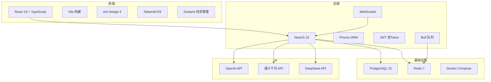

# 项目启动报告

> **项目名称：** Career-Copilot — AI 驱动的大学生求职面试与职业规划平台
> **文档版本：** V1.0
> **日期：** 2026-06-13
> **状态：** ✅ 已启动

---

## 一、项目背景

### 1.1 行业背景

当前大学生就业市场竞争激烈，2025 届全国高校毕业生预计达 1200 万人，而大多数学生在求职过程中面临以下困境：

- **零面试经验** — 缺乏真实面试体验，面试时紧张、表达混乱
- **信息不对称** — 不了解岗位要求和行业趋势，求职方向盲目
- **简历质量差** — 不会写简历，不知道如何突出自身优势
- **职业规划缺失** — 对未来职业发展路径没有清晰认知

### 1.2 项目目标

构建一个 **AI 驱动的求职辅助平台**，通过 AI 模拟面试、简历智能解析、个性化职业规划三大核心功能，帮助大学生提升求职竞争力。

---

## 二、项目范围

### 2.1 核心功能范围（MVP）

| 模块 | 功能 | 优先级 |
|:----:|------|:------:|
| 🔐 用户账户管理 | 注册、登录、Token 刷新、个人资料管理 | P0 |
| 📄 简历管理 | 简历上传（PDF/Word）、AI 解析、CRUD 操作 | P0 |
| 🎙️ AI 模拟面试 | 岗位选择、多轮对话、AI 追问评分、流式输出 | P0 |
| 📊 面试报告 | 综合评分、维度分析、改进建议、学习资源推荐 | P0 |
| 🎯 职业规划 | 技能差距分析、分阶段学习路线、市场洞察 | P1 |

### 2.2 非功能需求

| 类别 | 要求 |
|:----:|------|
| 性能 | 接口响应时间 < 2秒（不含 LLM 调用），并发支持 100+ |
| 可用性 | 系统可用性 ≥ 99.5% |
| 安全 | JWT 双 Token 认证，密码 bcrypt 加密 |
| 兼容性 | 支持 Chrome / Edge / Firefox 最新版本 |

### 2.3 不包含范围

- 语音面试（ASR/TTS）— 列为 P2 后期迭代
- 移动端原生 App — 仅提供 Web 端
- 企业招聘端功能 — 仅面向求职者
- 社区/论坛功能

---

## 三、团队组成

| 角色 | 姓名 | 专业班级 | 职责 |
|:----:|:----:|:--------:|------|
| 👑 **项目负责人** | **陶宏阳** | 软件 2402 | 架构设计、AI 引擎、面试模块、进度把控 |
| 🖥 **前端开发** | **邓继舟** | 软件 2402 | 面试对话页、简历管理页、登录注册页 |
| 🖥 **前端开发** | **李烨** | 软件 2402 | 职业规划页、仪表盘、个人中心、公共组件 |
| ⚙️ **后端开发** | **赵原一** | 软件 2402 | 数据库设计、Prisma Schema、业务模块 API、Docker 部署 |

---

## 四、技术选型

### 4.1 技术栈总览

### 4.2 详细技术栈

| 层级 | 技术 | 版本 | 用途 |
|:----:|------|:----:|------|
| 前端框架 | React | 18.x | UI 组件化开发 |
| 前端构建 | Vite | 5.x | 极速 HMR |
| UI 库 | Ant Design | 5.x | 企业级 UI 组件 |
| 样式 | TailwindCSS | 3.x | 原子化样式 |
| 状态管理 | Zustand | 4.x | 轻量状态管理 |
| 路由 | React Router | 6.x | SPA 路由 |
| 后端框架 | NestJS | 10.x | 模块化后端 |
| ORM | Prisma | 5.x | 类型安全数据库操作 |
| 数据库 | PostgreSQL | 15+ | 关系型存储 |
| 缓存 | Redis | 7+ | 会话缓存/消息队列 |
| 认证 | JWT | — | Access + Refresh Token |
| LLM | OpenAI / 通义千问 / DeepSeek | — | AI 面试/解析/规划 |

---

## 五、里程碑计划

| 里程碑 | 时间 | 交付物 |
|:------:|:----:|--------|
| M1 项目启动 | 第 1 周（6/12-6/13） | 项目启动报告、团队分工、技术选型 |
| M2 基础搭建 | 第 1-2 周（6/14-6/15） | 前后端项目框架、数据库表创建、Docker 环境 |
| M3 简历模块 | 第 3 周（6/16-6/17） | 简历上传解析、CRUD 接口、前端页面 |
| M4 AI 面试核心 ⭐ | 第 4-6 周（6/17-6/20） | LLM 接入、面试引擎、WebSocket、报告生成 |
| M5 职业规划 | 第 7-8 周 | 规划生成、市场洞察、前端页面 |
| M6 收尾交付 | 第 9 周 | 联调测试、UI 优化、部署、演示 |

> **实际进度（截至 6/18）：** M1~M4 已合并冲刺完成，后端核心功能基本就绪。

---

## 六、风险评估

| 风险 | 概率 | 影响 | 应对措施 |
|:----:|:----:|:----:|----------|
| LLM API 调用失败/超时 | 中 | 高 | 多 Provider 自动切换 + 重试机制 |
| Docker 镜像拉取慢 | 高 | 中 | 配置国内镜像加速 |
| 团队成员经验不足 | 高 | 中 | 前期架构示范 + Code Review |
| 前后端联调耗时 | 中 | 中 | 接口文档先行 + 尽早联调 |
| AI 输出质量不稳定 | 中 | 高 | Prompt 工程 + JSON 格式约束 |

---

## 七、沟通计划

| 方式 | 频率 | 参与人 | 内容 |
|:----:|:----:|:------:|------|
| 站会 | 每日 10:00 | 全员 | 昨日进度 + 今日计划 + 阻塞问题 |
| Code Review | 每次 PR | 对应 Reviewer | 代码质量 + 规范检查 |
| 进度同步 | 每周五 | 全员 | 周报汇总 + 调整计划 |
| 文档更新 | 随时 | 项目负责人 | 设计文档、接口文档 |

---

## 八、启动签字

| 角色 | 姓名 | 日期 | 签字 |
|:----:|:----:|:----:|:----:|
| 项目负责人 | 陶宏阳 | 2026-06-13 | ✅ |
| 前端开发 | 邓继舟 | 2026-06-13 | — |
| 前端开发 | 李烨 | 2026-06-13 | — |
| 后端开发 | 赵原一 | 2026-06-13 | — |
