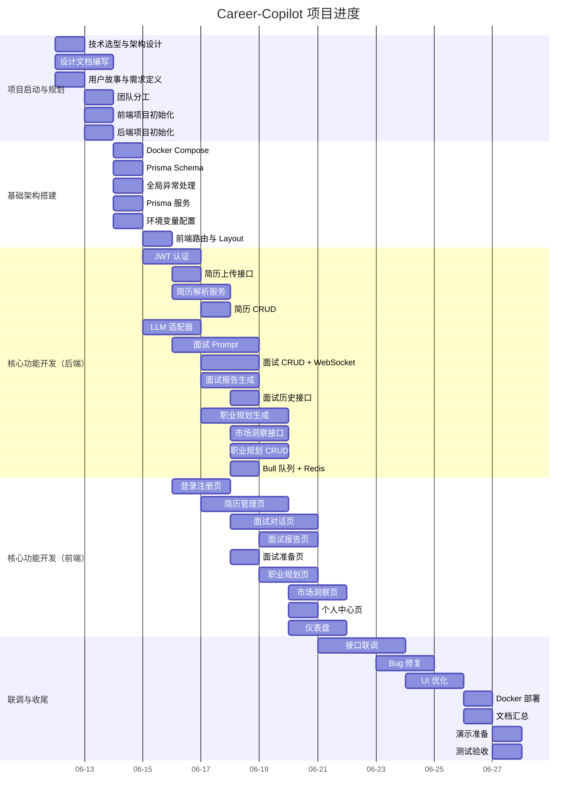

# 项目计划书

> **项目名称：** Career-Copilot — AI 驱动的大学生求职面试与职业规划平台
> **文档版本：** V1.0
> **日期：** 2026-06-13
> **更新日期：** 2026-06-18

---

## 一、项目概述

### 1.1 项目简介

Career-Copilot 是一个面向大学生的 AI 求职辅助平台，提供 AI 模拟面试、简历智能解析、个性化职业规划三大核心功能。项目采用前后端分离架构，前端 React + 后端 NestJS + PostgreSQL 数据库。

### 1.2 项目周期

| 阶段 | 时间范围 | 总周期 |
|:----:|:--------:|:------:|
| 项目启动与规划 | 2026/06/12 — 2026/06/13 | 2 天 |
| 基础架构搭建 | 2026/06/14 — 2026/06/15 | 2 天 |
| 核心功能开发 | 2026/06/16 — 2026/06/20 | 5 天 |
| 联调与优化 | 2026/06/21 — 2026/06/25 | 5 天 |
| 收尾与交付 | 2026/06/26 — 2026/06/28 | 3 天 |

---

## 二、任务分解（WBS）

### 阶段一：项目启动与规划（6/12-6/13）

| 编号 | 任务名称 | 负责人 | 工时 | 前置依赖 | 交付物 |
|:----:|----------|:------:|:----:|:--------:|--------|
| T-001 | 技术选型与架构设计 | 陶宏阳 | 1天 | — | 架构设计文档 |
| T-002 | 项目设计文档编写 | 陶宏阳 | 2天 | T-001 | 架构/API/数据库/规范等 8 份文档 |
| T-003 | 用户故事与需求定义 | 陶宏阳 | 1天 | — | 用户故事文档 |
| T-004 | 团队分工与任务分配 | 陶宏阳 | 0.5天 | T-003 | 分工文档 |
| T-005 | 前端项目初始化 | 邓继舟 | 1天 | — | 前端项目骨架 |
| T-006 | 后端项目初始化 | 赵原一 | 1天 | — | 后端项目骨架 |

### 阶段二：基础架构搭建（6/14-6/15）

| 编号 | 任务名称 | 负责人 | 工时 | 前置依赖 | 交付物 |
|:----:|----------|:------:|:----:|:--------:|--------|
| T-007 | Docker Compose 配置 | 赵原一 | 0.5天 | T-006 | docker-compose.yml |
| T-008 | Prisma Schema 设计 | 赵原一 | 1天 | T-006 | schema.prisma + migration |
| T-009 | 全局异常处理与响应格式 | 赵原一 | 0.5天 | T-006 | Filter + Interceptor |
| T-010 | Prisma 服务封装 | 赵原一 | 0.5天 | T-008 | PrismaService |
| T-011 | 环境变量配置 | 赵原一 | 0.5天 | T-006 | ConfigModule |
| T-012 | 前端路由与 Layout | 李烨 | 1天 | T-005 | 路由配置 + Layout |

### 阶段三：核心功能开发（6/16-6/20）

| 编号 | 任务名称 | 负责人 | 工时 | 前置依赖 | 交付物 |
|:----:|----------|:------:|:----:|:--------:|--------|
| T-013 | JWT 认证逻辑 | 陶宏阳 | 2天 | T-009~T-011 | 注册/登录/Token |
| T-014 | 简历上传接口 | 赵原一 | 1天 | T-013 | Multer + 文件存储 |
| T-015 | 简历解析服务 | 陶宏阳 | 2天 | T-013 | pdf-parse + OCR + LLM |
| T-016 | 简历 CRUD 接口 | 赵原一 | 1天 | T-014~T-015 | 列表/详情/删除 |
| T-017 | LLM 适配器封装 | 陶宏阳 | 1.5天 | — | 多 Provider 工厂 |
| T-018 | 面试 Prompt 工程 | 陶宏阳 | 3天 | T-017 | 5 个 Prompt 模板 |
| T-019 | 面试 CRUD + WebSocket | 陶宏阳 | 2天 | T-018 | 网关 + 流式输出 |
| T-020 | 面试报告生成 | 陶宏阳 | 2天 | T-019 | 综合评价报告 |
| T-021 | 面试历史接口 | 赵原一 | 1天 | T-019 | 分页筛选列表 |
| T-022 | 职业规划生成服务 | 陶宏阳 | 2.5天 | T-017 | 差距分析 + 学习路线 |
| T-023 | 市场洞察数据接口 | 赵原一 | 1.5天 | T-022 | 薪资/技能排行 |
| T-024 | 职业规划 CRUD | 赵原一 | 1.5天 | T-022~T-023 | 规划管理 |
| T-025 | Bull 队列配置 | 赵原一 | 1天 | — | QueueService |
| T-026 | Redis 服务封装 | 赵原一 | 1天 | — | RedisService |
| T-027 | 前端登录/注册页 | 邓继舟 | 1.5天 | T-013 | 登录注册 UI |
| T-028 | 前端简历管理页 | 邓继舟 | 3天 | T-014~T-016 | 上传/列表/详情 |
| T-029 | 前端面试对话页 | 邓继舟 | 3天 | T-019 | 流式渲染对话 |
| T-030 | 前端面试报告页 | 邓继舟 | 2天 | T-020 | 评分图表 |
| T-031 | 前端面试准备页 | 邓继舟 | 1天 | T-019 | 岗位选择 |
| T-032 | 前端职业规划页 | 李烨 | 2天 | T-022 | 规划展示 |
| T-033 | 前端市场洞察页 | 李烨 | 1.5天 | T-023 | 数据图表 |
| T-034 | 前端个人中心页 | 李烨 | 1天 | T-013 | 资料编辑 |
| T-035 | 前端仪表盘 | 李烨 | 1.5天 | T-028~T-034 | 数据概览 |

### 阶段四：联调与优化（6/21-6/25）

| 编号 | 任务名称 | 负责人 | 工时 | 前置依赖 | 交付物 |
|:----:|----------|:------:|:----:|:--------:|--------|
| T-036 | 前后端接口联调 | 全员 | 3天 | T-027~T-035 | 全功能可用 |
| T-037 | Bug 修复 | 全员 | 2天 | T-036 | 无重大 Bug |
| T-038 | UI 交互优化 | 邓继舟+李烨 | 2天 | T-036 | UI 打磨 |

### 阶段五：收尾与交付（6/26-6/28）

| 编号 | 任务名称 | 负责人 | 工时 | 前置依赖 | 交付物 |
|:----:|----------|:------:|:----:|:--------:|--------|
| T-039 | Docker 部署配置 | 赵原一 | 1天 | T-037 | Dockerfile |
| T-040 | 项目文档汇总 | 陶宏阳 | 1天 | T-039 | 完整文档 |
| T-041 | 演示准备 | 陶宏阳 | 0.5天 | T-040 | 演示 Demo |
| T-042 | 测试用例编写 | 全员 | 1天 | T-037 | 测试报告 |

---

## 三、甘特图

---

## 四、资源分配

### 4.1 人员投入

| 成员 | 总工时 | 主要投入阶段 |
|:----:|:------:|:------------|
| 陶宏阳 | ~18 天 | 全阶段（架构/AI/面试/文档） |
| 邓继舟 | ~13 天 | 阶段三~五（前端核心页面） |
| 李烨 | ~13 天 | 阶段二~五（前端辅线/公共组件） |
| 赵原一 | ~13 天 | 阶段一~五（后端/数据库/部署） |

### 4.2 开发环境资源

| 资源 | 用途 | 配置 |
|:----:|:----:|------|
| PostgreSQL 15 | 业务数据库 | Docker 容器，端口 5432 |
| Redis 7 | 缓存 + 消息队列 | Docker 容器，端口 6379 |
| Node.js 22+ | 后端运行环境 | 本地安装 |
| npm 10+ | 包管理 | Node.js 自带 |

---

## 五、风险管理计划

| 风险类别 | 具体风险 | 概率 | 影响 | 应对策略 | 责任人 |
|:--------:|----------|:----:|:----:|----------|:------:|
| 技术风险 | LLM API 不稳定 | 中 | 高 | 支持 3 个 Provider 自动切换 + 超时重试 | 陶宏阳 |
| 技术风险 | Docker 网络问题 | 高 | 中 | 配置国内镜像加速 | 赵原一 |
| 进度风险 | 成员经验不足 | 高 | 中 | 代码示范 + Code Review + 及时干预 | 陶宏阳 |
| 进度风险 | 联调周期不足 | 中 | 中 | 尽早启动接口验证 | 全员 |
| 质量风险 | AI 输出不稳定 | 中 | 高 | 严格的 Prompt 约束 + JSON Schema 校验 | 陶宏阳 |

---

## 六、质量保证计划

### 6.1 代码质量

- ESLint + Prettier 统一代码风格
- TypeScript strict 模式
- 禁止使用 `any` 类型
- 模块化分层清晰（Controller → Service → Provider）

### 6.2 测试策略

| 测试层级 | 覆盖范围 | 工具 | 责任人 |
|:--------:|----------|:----:|:------:|
| 单元测试 | Service 层核心逻辑 | Jest | 各模块负责人 |
| E2E 测试 | 核心 API 流程 | Supertest | 赵原一 |
| 手动测试 | 全部接口 | Swagger UI / REST Client | 全员 |
| 联调测试 | 前后端交互 | 前端页面 + 真实后端 | 全员 |

### 6.3 交付标准

- ✅ 所有 P0 功能可用
- ✅ 接口测试通过率 100%
- ✅ 无严重 Bug（不影响核心流程）
- ✅ Docker 一键部署

---

## 七、沟通管理计划

| 沟通方式 | 频率 | 参与者 | 内容 | 输出 |
|:--------:|:----:|:------:|------|:----:|
| 每日站会 | 每天 10:00 | 全员 | 进度同步 + 问题沟通 | 纪要 |
| Code Review | 每次提交 | 项目负责人 | 代码审查 | Review 意见 |
| 周报 | 每周五 | 全员 | 周工作总结 | 周报文档 |
| 即时沟通 | 随时 | 全员 | 微信/QQ 群 | — |

---

## 八、计划变更记录

| 版本 | 日期 | 变更内容 | 变更原因 |
|:----:|:----:|----------|:--------:|
| V1.0 | 2026-06-13 | 初始计划 | — |
| V1.1 | 2026-06-18 | 实际进度更新：后端核心提前完成 | 开发效率超预期，多任务并行 |
