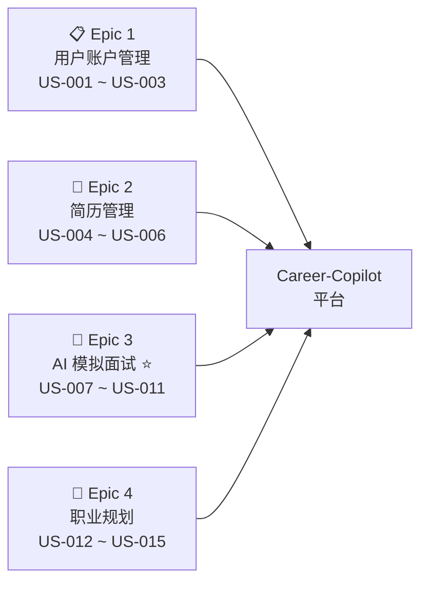
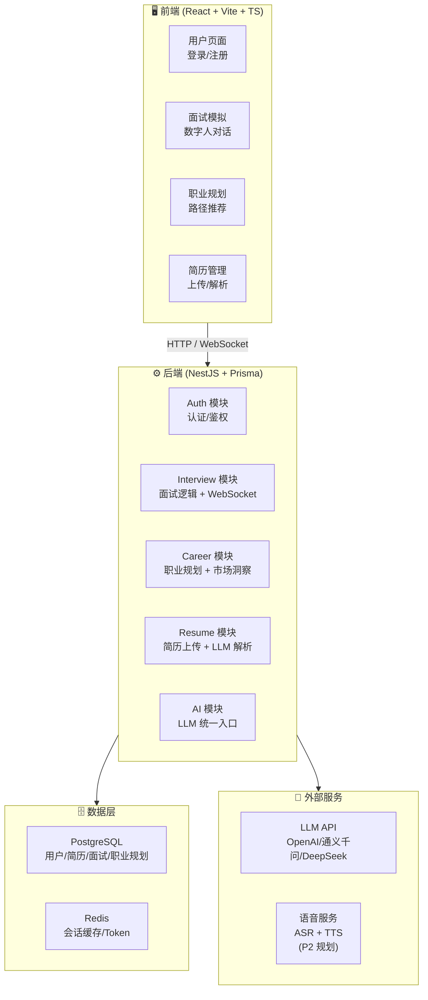
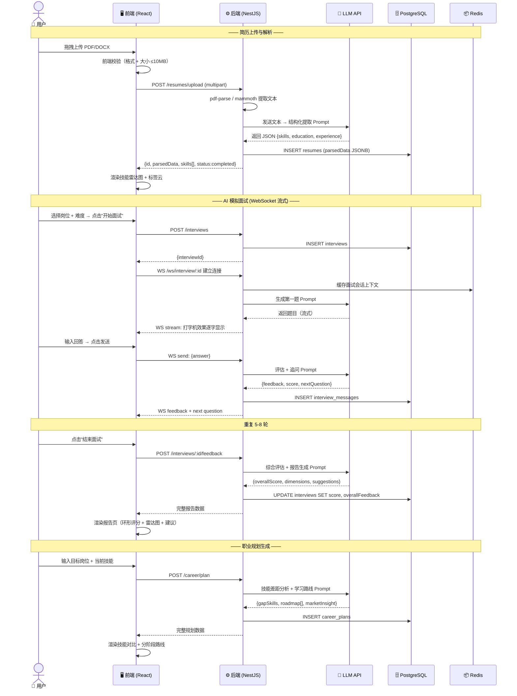
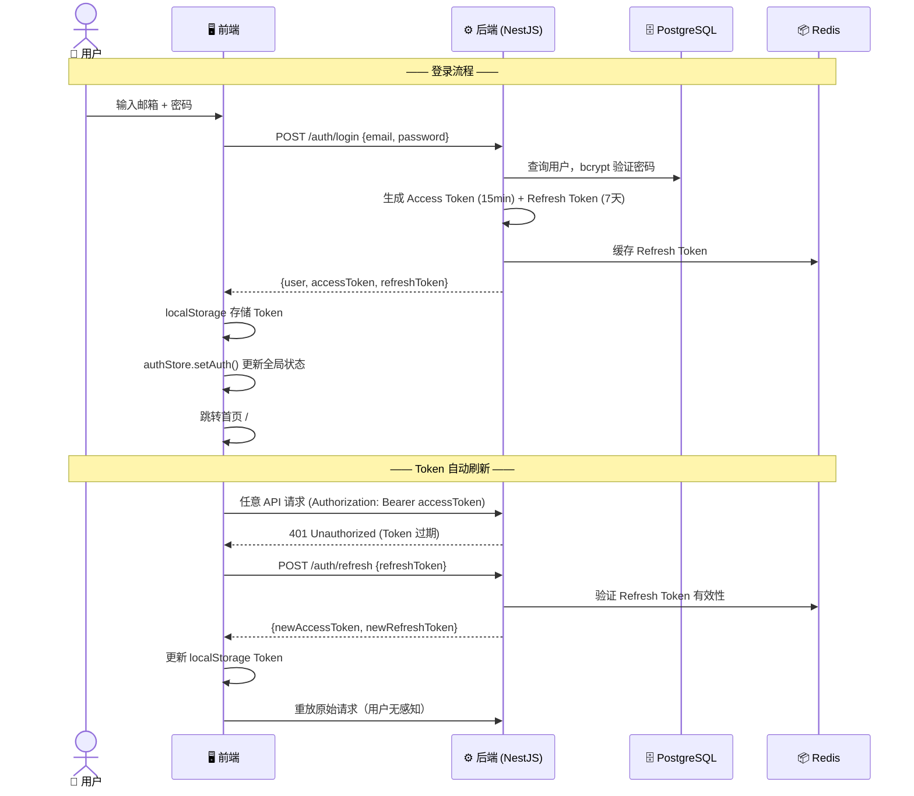
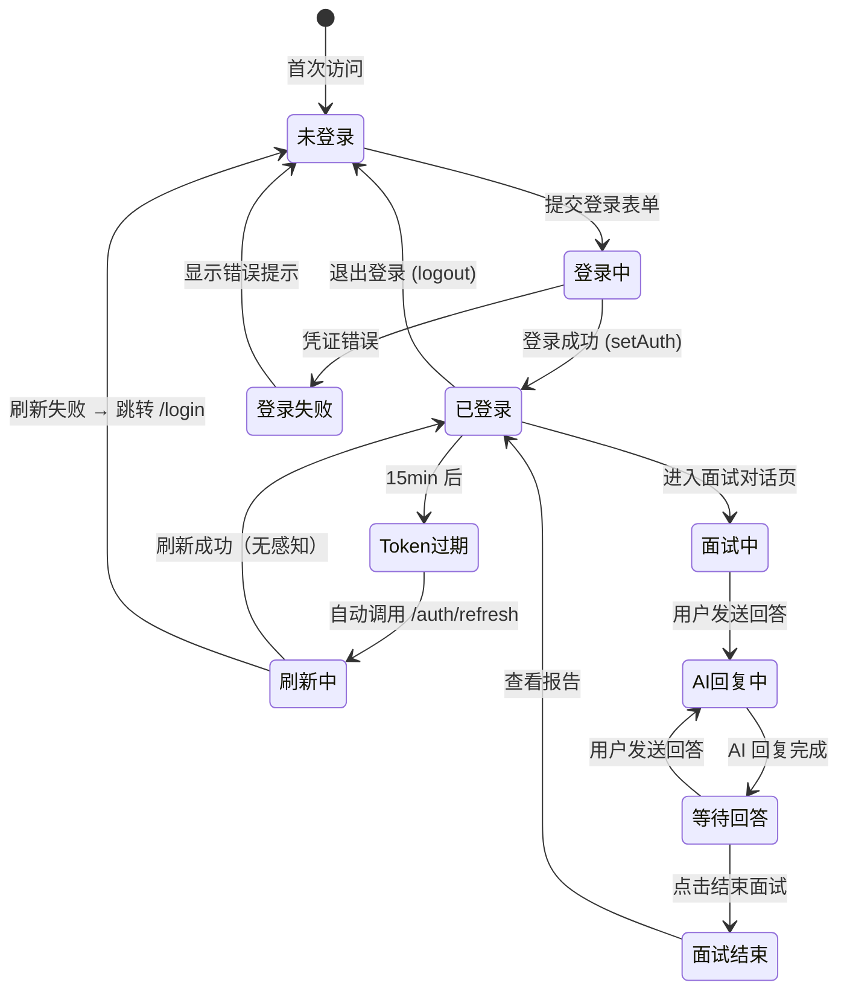
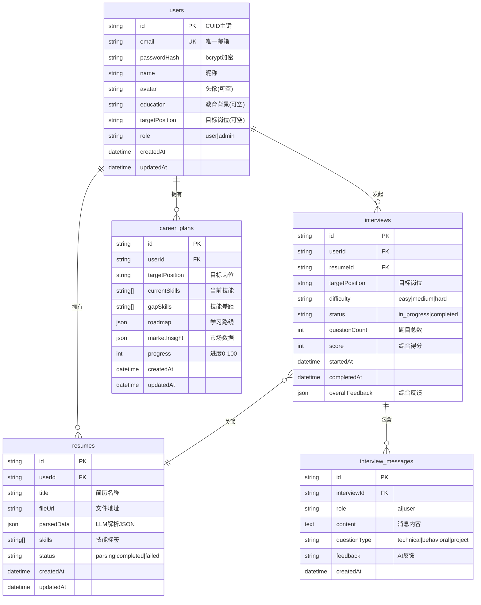
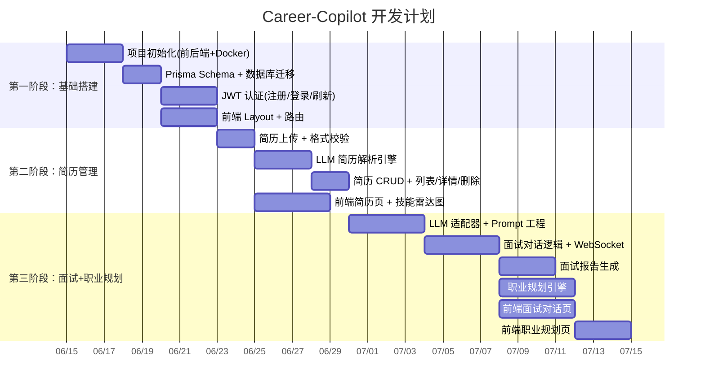

# Career-Copilot 需求分析评审汇报

> **项目名称**：Career-Copilot — AI 驱动的大学生求职面试与职业规划平台
> **汇报日期**：2026 年 6 月 24 日
> **团队**：软件 2402 班 Career-Copilot 组

---

## 目录

1. [项目概述](#一项目概述)
2. [用户分析](#二用户分析)
3. [功能需求](#三功能需求)
4. [非功能需求](#四非功能需求)
5. [系统架构设计](#五系统架构设计)
   - [5.1 技术栈选型](#51-技术栈选型)
   - [5.2 系统整体架构图](#52-系统整体架构图)
   - [5.3 后端模块架构](#53-后端模块架构)
   - [5.4 前端项目架构](#54-前端项目架构)
     - [5.4.1 前端目录结构](#541-前端目录结构)
     - [5.4.2 前端路由设计](#542-前端路由设计)
     - [5.4.3 前端状态管理](#543-前端状态管理)
     - [5.4.4 前端 API 层设计](#544-前端-api-层设计)
   - [5.5 前端界面设计](#55-前端界面设计)
   - [5.6 全栈数据流设计](#56-全栈数据流设计)
6. [数据库设计](#六数据库设计)
7. [API 接口设计](#七api-接口设计)
   - [7.1 统一规范](#71-统一规范)
   - [7.2 认证模块 Auth](#72-️-认证模块auth-apiauth)
   - [7.3 用户模块 User](#73--用户模块user-apiusers)
   - [7.4 简历模块 Resume](#74--简历模块resume-apiresumes)
   - [7.5 面试模块 Interview ⭐](#75-️-面试模块interview-apiinterviews-)
   - [7.6 职业规划模块 Career](#76--职业规划模块career-apicareer)
   - [7.7 AI 服务模块](#77--ai-服务模块ai-apiai)
   - [7.8 接口统计总览](#78-接口统计总览)
8. [开发计划与分工](#八开发计划与分工)
9. [风险分析](#九风险分析)

---

## 一、项目概述

### 1.1 项目背景

大学生求职常陷三大困境：

- 🔴 **零面试经验** — 不会面试、不懂流程、临场紧张
- 🟡 **简历石沉大海** — 不擅提炼亮点、技能描述模糊、海投无回音
- 🟠 **职业方向迷茫** — 不了解各岗位要求、缺乏清晰成长路径

### 1.2 解决方案

Career-Copilot 是一个 **AI 驱动的求职面试与职业规划平台**，提供四大核心能力：

| 核心能力 | 说明 |
|----------|------|
| 🤖 **AI 模拟面试** | 根据目标岗位自动出题，多轮追问 + 即时评分 + 流式对话 |
| 📄 **简历智能解析** | 上传 PDF/Word，AI 自动提取技能树与经历，生成技能雷达图 |
| 📊 **多维面试报告** | 专业能力、沟通表达、逻辑思维、项目经验四维评估 + 改进建议 |
| 🎯 **职业规划** | 技能差距分析 + 分阶段学习路线 + 市场洞察推荐 |

### 1.3 目标用户

在校大学生（大二～大四）、应届毕业生、0-3 年经验的职场新人。

---

## 二、用户分析

### 2.1 用户画像总览

| 编号 | 画像 | 用户群体 | 核心需求 | 技术敏感度 |
|:----:|------|----------|----------|:----------:|
| P-01 | 迷茫的大三学生 | 零实习经验、方向不明 | 了解岗位要求、积累面试经验 | 中 |
| P-02 | 冲刺的应届毕业生 | 正在秋招、多次面试失败 | 高强度训练、针对性改进 | 高 |
| P-03 | 跨专业求职者 | 非科班转行（如机械→算法） | 技能差距分析、学习路径规划 | 中 |
| P-04 | 职场跳槽者 | 1-3 年经验、寻求更好机会 | 高阶面试模拟、市场行情参考 | 高 |
| P-05 | 职业迷茫期用户 | 刚毕业、方向不明确 | 职业探索、个性化推荐 | 低 |

### 2.2 典型用户画像详解

#### P-01：迷茫的大三学生 — 张小明

> *"马上要大四了，我连面试长什么样都不知道……"*

- 武汉某双非一本，软件工程大三，只会 Java/Python 基础，无项目经验
- **目标**：了解岗位区别、体验完整面试流程、明确学习方向
- **痛点**：信息差 → 缺乏自信 → 无从下手 → 简历空白

#### P-02：冲刺的应届毕业生 — 李思雨

> *"秋招已经开始一个多月了，面了 5 家全挂了，问题到底出在哪？"*

- 武汉某 211 计算机大四，LeetCode 200+，1 段中小厂实习经历
- **目标**：找出面试失败的根因、针对性提升表达能力
- **痛点**：表现失常 → 缺乏反馈 → 表达无条理 → 压力面不适应

#### P-03：跨专业求职者 — 王浩然

> *"本科学的机械，自学的机器学习，想转行算法工程师但简历投出去都没回音"*

- 985 机械硕士，自学 Python/ML，Kaggle 打过比赛
- **目标**：了解算法岗真实要求、对比技能差距、积累算法面试经验
- **痛点**：专业不对口 → 技能树不完整 → 简历初筛就被刷

---

## 三、功能需求

### 3.1 Epic 全景图



### 3.2 用户故事列表（按优先级）

#### P0（核心功能，MVP 必须交付）

| 编号 | 功能 | 用户角色 | 描述 |
|:----:|------|----------|------|
| US-001 | 用户注册 | 访客 | 邮箱 + 密码注册，注册后自动登录 |
| US-002 | 用户登录 | 求职者 | 邮箱 + 密码登录；支持"记住我" |
| US-004 | 上传简历 | 求职者 | 上传 PDF/Word 简历（≤10MB），系统自动解析 |
| US-005 | 查看解析结果 | 求职者 | 技能标签云、工作经历、教育背景、技能雷达图 |
| US-007 | 选择面试岗位 | 求职者 | 选择岗位（10+ 热门岗位）和难度（简单/中等/困难） |
| US-008 | 进行模拟面试 | 求职者 | AI 出题 → 用户回答 → AI 评分 + 追问（5-8 轮），流式输出 |
| US-009 | 查看面试报告 | 求职者 | 综合评分 + 四维评估 + 优缺点 + 改进建议 |
| US-012 | 生成职业路径 | 求职者 | 输入目标岗位 → AI 分析技能差距 → 生成分阶段学习路线 |

#### P1（重要功能，第二批交付）

| 编号 | 功能 | 用户角色 | 描述 |
|:----:|------|----------|------|
| US-003 | 个人资料管理 | 求职者 | 编辑头像、昵称、教育背景、目标岗位 |
| US-006 | 管理多份简历 | 求职者 | 针对不同岗位上传和管理多版简历 |
| US-010 | 回顾面试历史 | 求职者 | 查看历史面试记录、评分趋势图 |
| US-013 | 查看市场洞察 | 求职者 | 岗位薪资范围、需求热度、必备技能 Top 10 |
| US-014 | 学习资源推荐 | 求职者 | 根据技能差距推荐课程/书籍/项目 |

#### P2（进阶功能，后续迭代）

| 编号 | 功能 | 用户角色 | 描述 |
|:----:|------|----------|------|
| US-011 | 语音面试 | 求职者 | 通过语音与 AI 面试官对话（TTS + ASR） |

### 3.3 核心功能流程

#### AI 模拟面试流程

```
用户选择岗位 + 难度 → AI 生成第一题
                            ↓
          ┌─────── 用户回答 ───────┐
          ↓                         ↓
     AI 评估 + 追问            AI 评估 + 下一题
          ↓                         ↓
     （重复 5-8 轮）          （重复 5-8 轮）
          ↓                         ↓
          └─────── 面试结束 ────────┘
                        ↓
                  生成面试报告
           （综合评分 + 四维评估 + 改进建议）
```

#### 简历解析流程

```
上传 PDF/Word → 文件格式校验 → 文档转文本(pdf-parse/mammoth)
                                      ↓
                            LLM 结构化提取（JSON）
                                      ↓
                   ┌──────────────────┼──────────────────┐
                   ↓                  ↓                  ↓
              技能标签             工作经历           教育背景
                   ↓
            技能雷达图可视化
```

#### 职业规划流程

```
输入目标岗位 + 当前技能（或上传简历自动提取）
                      ↓
         LLM + 市场数据 → 分析技能差距
                      ↓
    ┌─────────────────┼─────────────────┐
    ↓                 ↓                  ↓
已掌握技能        技能差距清单        市场洞察
                      ↓
         分阶段学习路线（阶段/目标/内容/时间）
                      ↓
              学习资源推荐（课程/书籍/项目）
```

---

## 四、非功能需求

| 分类 | 需求项 | 指标/说明 |
|------|--------|-----------|
| 🔐 **安全性** | 认证 | JWT 双 Token（Access 15min + Refresh 7天） |
| | 密码加密 | bcrypt（salt rounds ≥ 10） |
| | 文件安全 | 上传校验 MIME 类型 + 大小限制 10MB |
| ⚡ **性能** | 面试对话响应 | AI 回复延迟 < 5s（流式首字 < 1s） |
| | 简历解析 | 同步解析完成 < 30s |
| | 并发支持 | 同时支持 50+ 在线面试会话 |
| 📐 **可用性** | 前端交互 | 现代化界面（Ant Design 5 + TailwindCSS） |
| | 响应式 | 支持 PC / 笔记本主流分辨率 |
| | 错误处理 | 统一异常过滤器 + 友好错误提示 |
| 🧩 **可维护性** | 代码规范 | Conventional Commits + ESLint + Prettier |
| | 分支策略 | Git Flow（main → develop → feat/xxx） |
| | 接口文档 | 项目内维护完整 API 文档 |
| 📦 **可部署性** | 容器化 | Docker Compose 一键启动 PostgreSQL + Redis + App |
| | 环境配置 | .env 环境变量管理，不提交敏感信息 |

---

## 五、系统架构设计

### 5.1 技术栈选型

| 层级 | 技术 | 选型理由 |
|------|------|----------|
| 🖥 **前端** | React 18 + TypeScript + Vite | 组件化开发、极速 HMR |
| | Ant Design 5 + TailwindCSS | 企业级 UI + 原子化样式 |
| | Zustand + React Router v6 | 轻量状态管理 + SPA 路由 |
| | ECharts / AntV | 技能雷达图等可视化 |
| ⚙️ **后端** | NestJS 10 + Prisma 5 | 模块化架构、TS 原生支持、类型安全 ORM |
| | JWT (Passport) | 双 Token 认证 |
| | WebSocket (Socket.IO) | 面试实时对话流式输出 |
| 🗄️ **存储** | PostgreSQL 15 | 关系型数据：用户、简历、面试、职业规划 |
| | Redis 7 | 面试会话缓存 + Token 黑名单 |
| 🤖 **AI** | OpenAI / 通义千问 / DeepSeek API | LLM 多模型适配：面试生成、简历解析、职业规划 |
| 🐳 **部署** | Docker + Docker Compose | 一键启动全部服务 |

### 5.2 系统整体架构图



### 5.3 后端模块架构

```
backend/src/
├── auth/                    # 认证模块
│   ├── auth.controller.ts   # 注册/登录/刷新Token/个人资料
│   ├── auth.service.ts      # 认证业务逻辑
│   ├── strategies/          # JWT策略 + 可选OAuth
│   └── guards/              # 角色守卫
├── resume/                  # 简历模块
│   ├── resume.controller.ts # 上传/CRUD
│   ├── resume.service.ts    # 同步解析逻辑
│   └── resume.parser.ts     # PDF/DOCX提取 + LLM解析引擎
├── interview/               # 面试模块 ⭐
│   ├── interview.controller.ts    # 面试CRUD
│   ├── interview.service.ts       # 面试业务
│   ├── interview.gateway.ts       # WebSocket实时对话
│   ├── ai-interview.service.ts    # AI面试逻辑
│   └── interview-report.service.ts # 报告生成
├── career/                  # 职业规划模块
│   ├── career.controller.ts
│   ├── career.service.ts
│   └── market-insight.service.ts  # 市场洞察
├── ai/                      # AI统一服务层
│   ├── ai.controller.ts     # 5个AI端点
│   ├── ai.service.ts
│   ├── llm.provider.ts      # 多模型适配器
│   └── prompts/             # 5类Prompt模板
├── common/                  # 公共模块
│   ├── prisma.service.ts    # 数据库服务
│   ├── filters/             # 统一异常过滤器
│   └── interceptors/        # 响应拦截器
└── main.ts                  # 入口
```

### 5.4 前端项目架构

前端基于 **React 18 + TypeScript + Vite** 构建，采用 **Ant Design 5 + TailwindCSS** 组件库与原子化样式，**Zustand** 管理全局状态，**React Router v6** 实现 SPA 路由，**ECharts** 实现数据可视化（技能雷达图、评分趋势图等）。

#### 5.4.1 前端目录结构

```
frontend/
├── public/                          # 静态资源（favicon、字体等）
├── src/
│   ├── api/                         # API 接口层
│   │   ├── client.ts               # Axios 实例 + 拦截器（Token 注入/刷新）
│   │   ├── auth.ts                 # 认证相关 API
│   │   ├── resume.ts               # 简历相关 API
│   │   ├── interview.ts            # 面试相关 API
│   │   ├── career.ts               # 职业规划相关 API
│   │   └── types/                  # API 请求/响应类型定义
│   ├── assets/                      # 图片、图标等静态资源
│   ├── components/                  # 公共组件
│   │   ├── Layout/                  # 布局组件（AppLayout / Sidebar / Header / Footer）
│   │   ├── SkillRadar/             # 技能雷达图组件（echarts-for-react）
│   │   ├── InterviewTimer/         # 面试计时器
│   │   ├── ScoreCard/              # 评分卡片组件
│   │   ├── MarkdownRenderer/       # Markdown 渲染组件
│   │   └── common/                 # 通用组件（Loading / EmptyState / ErrorBoundary / ConfirmModal）
│   ├── hooks/                       # 自定义 Hooks
│   │   ├── useAuth.ts              # 认证状态管理
│   │   ├── useWebSocket.ts         # WebSocket 连接管理（断线重连）
│   │   ├── useStreamingText.ts     # 流式文本渲染（打字机效果）
│   │   └── usePagination.ts        # 分页逻辑
│   ├── pages/                       # 页面（按模块分文件夹）
│   │   ├── Login/                  # 登录/注册
│   │   ├── Home/                   # 仪表盘首页
│   │   ├── Resume/                 # 简历管理（列表/上传/详情）
│   │   ├── Interview/              # 面试模块（准备/对话/报告/历史）
│   │   ├── CareerPlan/             # 职业规划（生成/详情/市场洞察）
│   │   └── Profile/                # 个人中心
│   ├── store/                       # Zustand 状态管理
│   │   ├── authStore.ts            # 认证状态（user / token）
│   │   ├── interviewStore.ts       # 面试会话状态（消息流式追加）
│   │   └── appStore.ts             # 全局 UI 状态
│   ├── types/                       # 全局 TypeScript 类型定义
│   ├── utils/                       # 工具函数（Token 存储 / 日期格式化 / 表单校验 / 常量）
│   ├── App.tsx                      # 根组件（路由配置 + ProtectedRoute）
│   └── main.tsx                     # 入口文件
├── vite.config.ts                   # Vite 构建配置
├── tailwind.config.js               # TailwindCSS 主题配置
└── package.json
```

#### 5.4.2 前端路由设计

| 路由 | 页面 | 权限 | 说明 |
|------|------|:----:|------|
| `/login` | 登录/注册 | 公开 | 邮箱密码 + 表单校验，Tab 切换登录/注册 |
| `/` | 仪表盘首页 | 需登录 | 统计卡片 + 快捷入口 + 评分趋势图 |
| `/resume` | 简历列表 | 需登录 | 卡片列表 + 分页 + 状态筛选 |
| `/resume/upload` | 简历上传 | 需登录 | 拖拽上传 PDF/DOCX（≤10MB） |
| `/resume/:id` | 简历详情 | 需登录 | 解析结果 + 技能雷达图 + 编辑 |
| `/interview` | 面试准备 | 需登录 | 三步引导：选岗位 → 选难度 → 关联简历 |
| `/interview/:id` | 面试对话 ⭐ | 需登录 | 聊天式界面，WebSocket 流式对话 |
| `/interview/:id/report` | 面试报告 | 需登录 | 四维评估 + 雷达图 + 改进建议 |
| `/interview/history` | 面试历史 | 需登录 | 筛选 + 分页表格 + 评分趋势 |
| `/career-plan` | 职业规划 | 需登录 | 规划列表 + 生成新规划 |
| `/career-plan/:id` | 规划详情 | 需登录 | 技能差距 + 分阶段路线 + 学习资源 |
| `/career-plan/market-insight` | 市场洞察 | 需登录 | 薪资范围 + 需求趋势 + 技能排行 |
| `/profile` | 个人中心 | 需登录 | 编辑资料 / 头像上传 |

**路由守卫（ProtectedRoute）**：检查 `authStore.isAuthenticated`，未登录自动重定向到 `/login`。面试对话页使用简化全屏布局（隐藏侧边栏）。

#### 5.4.3 前端状态管理

采用 **Zustand** 轻量级状态管理，按职责拆分为三个 Store：

**`authStore` — 认证状态**

```typescript
interface AuthState {
  user: UserProfile | null;
  isAuthenticated: boolean;
  setAuth: (user, accessToken, refreshToken) => void;  // 登录成功
  logout: () => void;                                   // 清除 Token 并跳转
  updateUser: (data) => void;                           // 更新用户资料
}
```
- 使用 Zustand `persist` 中间件将 user 持久化到 localStorage
- 应用启动时从 localStorage 读取 Token，调用 `GET /auth/profile` 验证有效性

**`interviewStore` — 面试会话状态**

```typescript
interface InterviewState {
  currentInterview: Interview | null;
  messages: Message[];
  isAIResponding: boolean;
  setInterview: (interview) => void;
  addMessage: (message) => void;
  appendToLastMessage: (chunk: string) => void;  // 流式追加字符
  setAIResponding: (val: boolean) => void;
  reset: () => void;
}
```

**`appStore`** — 全局 UI 状态（侧边栏折叠、全局 Loading、通知计数等）

#### 5.4.4 前端 API 层设计

**Axios 实例与拦截器**（`src/api/client.ts`）：

```
请求拦截器                      响应拦截器
┌──────────────┐              ┌──────────────────────────┐
│ 从 localStorage │  ──→ axios ──→  │ 成功：直接返回 response.data │
│ 读取 accessToken │              │ 401：自动调用 /auth/refresh │
│ 注入 Authorization│              │      → 刷新成功：重放原请求   │
│ 请求头          │              │      → 刷新失败：清除 Token    │
└──────────────┘              │           → 跳转 /login        │
                              └──────────────────────────┘
```

- `baseURL` 从环境变量 `VITE_API_BASE_URL` 读取（开发环境 `http://localhost:3001/api/v1`）
- 统一错误处理，将后端错误码映射为中文提示
- API 函数按模块拆分（`auth.ts` / `resume.ts` / `interview.ts` / `career.ts`），每个函数返回类型化的 Promise

**WebSocket 连接管理**（`src/hooks/useWebSocket.ts`）：

```
useWebSocket Hook
├── connect(interviewId)     → 建立 ws://host/api/v1/ws/interview/:id
├── disconnect()             → 主动关闭连接
├── sendMessage(content)     → 发送用户回答
├── isConnected              → 连接状态
├── messages: WSMessage[]    → 消息列表
└── isAIResponding           → AI 是否正在回复
```

- 支持断线重连机制（指数退避，最大重试 5 次）
- WebSocket 事件：`question`（AI 出题）、`stream`（流式文本块）、`feedback`（评分反馈）、`end`（面试结束）

**流式渲染 Hook**（`src/hooks/useStreamingText.ts`）：

```typescript
function useStreamingText(fullText: string, speed = 30): string {
  // 按字符逐步显示，每 speed ms 增加一个字符，实现打字机效果
  // 返回当前已显示的部分文本
}
```

### 5.5 前端界面设计

前端基于 **React 18 + TypeScript + Vite + Ant Design 5 + TailwindCSS + ECharts** 构建，采用响应式布局，包含以下核心界面：

#### 5.5.1 整体布局（AppLayout）

```
┌──────────────────────────────────────┐
│         Header（顶栏）                │
│   Logo   导航标签   用户头像+下拉      │
├────────┬─────────────────────────────┤
│        │                             │
│ Sidebar│     Content（路由出口）       │
│  (可折叠)│                            │
│        │                             │
└────────┴─────────────────────────────┘
```

- 侧边栏可折叠（大屏展开，小屏自动收起为图标模式），导航项包括：仪表盘、简历管理、模拟面试、职业规划、个人中心
- 顶栏右侧：用户头像 + 昵称下拉菜单（个人中心/退出登录）
- 面试对话页使用简化全屏布局（隐藏侧边栏）

#### 5.5.2 登录/注册页

左右分栏设计：左侧展示平台品牌形象（Logo + Slogan），右侧为登录/注册表单，支持 Tab 切换。表单包含邮箱、密码、"记住我"复选框，底部"没有账号？立即注册"链接。支持实时表单校验、密码显隐切换、按钮 Loading 状态。

#### 5.5.3 仪表盘首页

- **问候语**：根据时间段变化（早上/下午/晚上）
- **统计卡片**：面试次数、平均分、简历数、规划进度
- **快速入口**：三个大按钮 — 开始面试、上传简历、职业规划
- **最近面试记录**：列表展示岗位、难度、评分、时间
- **评分趋势图**：ECharts 折线图展示最近 7 次面试评分趋势

#### 5.5.4 简历管理模块

| 页面 | 设计要点 |
|------|----------|
| **简历列表页** | 卡片列表展示简历名称、解析状态（解析中/已完成/失败）、技能标签（前 5 个）、上传时间；hover 显示操作按钮（查看/删除/设为默认）；支持分页 |
| **简历上传页** | 大面积拖拽上传区域（Ant Design Upload.Dragger），仅允许 PDF/DOCX，≤10MB；上传进度条；上传成功跳转详情页 |
| **简历详情页** | 左右布局：左侧基本信息（姓名/电话/邮箱），右侧 ECharts 技能雷达图；下方依次展示教育背景、工作经历、项目经验、技能标签云；支持手动编辑解析结果和重新解析 |

**技能雷达图组件**：基于 `echarts-for-react` 封装，展示技能掌握程度（维度如 Java、Spring Boot、MySQL、Redis 等），分值从 LLM 评估得出，空数据时显示"暂无技能数据"。

#### 5.5.5 AI 模拟面试模块（核心）

| 页面 | 设计要点 |
|------|----------|
| **面试准备页** | 三步引导式配置 — Step 1 选择目标岗位（≥10 个热门岗位网格 + 搜索）、Step 2 选择难度（简单/中等/困难卡片）、Step 3 选择关联简历（可选下拉）；底部"开始面试"大按钮 |
| **面试对话页** ⭐ | **仿聊天界面**：顶部导航栏（返回 + 岗位/难度 + 计时器），中间消息列表（AI 消息左对齐带评分 ⭐1-5，用户消息右对齐），底部输入框 + 发送按钮 + "结束面试"按钮。AI 回复支持流式打字机效果（WebSocket），消息列表自动滚动到底部，显示当前轮次（第 N/8 轮），面试结束后跳转报告页 |
| **面试报告页** | 综合评分为环形进度条；四维评估（专业技能/沟通表达/逻辑思维/项目经验）+ 雷达图；优点与待改进左右两栏；各题目得分列表；改进建议按优先级（高/中）分组，附带推荐学习资源 |
| **面试历史页** | 筛选区（状态/难度/岗位搜索）+ Ant Design Table 列表；评分趋势 ECharts 折线图；操作按钮根据状态动态展示（查看报告/继续面试） |

#### 5.5.6 职业规划模块

| 页面 | 设计要点 |
|------|----------|
| **职业规划页** | 已有规划卡片列表（目标岗位 + 进度条 + 时间）+ 生成新规划区域（AutoComplete 搜索岗位，上传简历或手动 Tag 输入当前技能）；生成 Loading 状态（3-5 秒），成功自动跳转详情 |
| **规划详情页** | 技能差距分析：两栏对比（已掌握 ✅ vs 待学习 ❌）；分阶段学习路线：Ant Design Collapse 可折叠面板，每阶段含目标 + 学习资源列表（名称/类型/链接）；进度滑块可手动调整；支持标记"已学" |
| **市场洞察页** | 岗位搜索 → 薪资范围条形图 + 需求趋势折线图 + Top 10 技能横向条形图 + 经验分布饼图 |

#### 5.5.7 个人中心

顶部用户头像（可点击上传更换）+ 昵称 + 邮箱；编辑表单（昵称/教育背景/目标岗位）；账号安全区域（修改密码，P2）。

#### 5.5.8 通用组件

| 组件 | 说明 |
|------|------|
| `Loading` | 全局加载骨架屏 / Spin |
| `EmptyState` | 空状态占位（图标 + 文字 + 操作按钮） |
| `ErrorBoundary` | React 错误边界，捕获渲染异常降级 UI |
| `ConfirmModal` | 通用确认弹窗（删除/退出等操作） |
| `MarkdownRenderer` | Markdown 渲染组件 |
| `InterviewTimer` | 面试计时器（MM:SS 格式，实时递增） |

### 5.6 全栈数据流设计

#### 5.6.1 核心业务数据流



#### 5.6.2 认证与鉴权流



#### 5.6.3 前端状态流转



---

## 六、数据库设计

### 6.1 ER 图



### 6.2 核心表说明

| 表名 | 核心字段 | 说明 |
|------|----------|------|
| `users` | email, passwordHash, name, education, targetPosition | 用户账号与个人信息 |
| `resumes` | userId, title, fileUrl, parsedData(JSONB), skills[], status | 简历文件 + LLM 结构化解析结果 |
| `interviews` | userId, resumeId, targetPosition, difficulty, score, overallFeedback | 面试会话记录与综合评分 |
| `interview_messages` | interviewId, role(ai/user), content, feedback | 面试对话消息 + 逐轮评分 |
| `career_plans` | userId, targetPosition, currentSkills, gapSkills, roadmap(JSON) | 职业规划与分阶段学习路线 |

---

## 七、API 接口设计

> 基础路径：`/api` | 认证方式：JWT Bearer Token（`Authorization: Bearer <access_token>`）

### 7.1 统一规范

**统一响应格式：**

```json
{
  "code": 200,
  "message": "success",
  "data": { }
}
```

| 规范项 | 说明 |
|:------:|------|
| 基础路径 | 所有接口以 `/api` 为前缀 |
| 认证方式 | `Authorization: Bearer <access_token>`（Auth 模块 3 接口公开，其余需认证） |
| 分页参数 | `page`（默认 1）、`limit`（默认 10） |
| 文件上传 | `multipart/form-data`，格式限制 PDF/DOCX，大小限制 10MB |
| 错误处理 | 统一异常过滤器（`code` + `message`），401 自动刷新 Token |

---

### 7.2 🔐 认证模块（Auth）— `/api/auth`

| 方法 | 路径 | 认证 | 功能说明 | Request | Response |
|:----:|------|:----:|----------|---------|----------|
| **POST** | `/auth/register` | ❌ | 用户注册 | `{ email, password, name }` | `{ user, accessToken, refreshToken }` |
| **POST** | `/auth/login` | ❌ | 用户登录 | `{ email, password }` | `{ user, accessToken, refreshToken }` |
| **POST** | `/auth/refresh` | ❌ | 刷新 Token | `{ refreshToken }` | `{ accessToken, refreshToken }` |
| **GET** | `/auth/profile` | ✅ | 获取个人资料 | — | `{ id, email, name, avatar, education, targetPosition, role }` |
| **PATCH** | `/auth/profile` | ✅ | 修改个人资料 | `{ name?, avatar?, education?, targetPosition? }` | `{ ...userProfile }` |

---

### 7.3 👤 用户模块（User）— `/api/users`

| 方法 | 路径 | 认证 | 功能说明 | 查询参数 |
|:----:|------|:----:|----------|----------|
| **GET** | `/users` | ✅ | 获取用户列表（全部用户） | `?id=xxx` 可选，传入则返回指定用户详情 |

---

### 7.4 📄 简历模块（Resume）— `/api/resumes`

| 方法 | 路径 | 认证 | 功能说明 | 说明 |
|:----:|------|:----:|----------|------|
| **POST** | `/resumes/upload` | ✅ | 上传简历（同步解析） | `multipart/form-data`，`file` 字段（PDF/DOCX，≤10MB）；上传后自动调用 LLM 解析 |
| **GET** | `/resumes` | ✅ | 简历列表（分页） | `?page=1&limit=10&status=completed`，status 筛选：`parsing`/`completed`/`failed` |
| **GET** | `/resumes/:id` | ✅ | 简历详情 | 返回解析后的结构化数据 + 原始文件 URL |
| **PUT** | `/resumes/:id` | ✅ | 编辑简历 | `{ title?, parsedData? }` 手动修正解析结果 |
| **DELETE** | `/resumes/:id` | ✅ | 删除简历 | 同时删除服务器文件 |

**上传响应示例：**
```json
{
  "id": "clx...",
  "title": "张三-后端开发工程师",
  "fileUrl": "/uploads/resumes/xxx.pdf",
  "parsedData": {
    "name": "张三",
    "phone": "138xxxx",
    "email": "zhang@xx.com",
    "education": [...],
    "experience": [...],
    "projects": [...]
  },
  "skills": ["Java", "Spring Boot", "MySQL", "Redis", "Docker"],
  "status": "completed"
}
```

---

### 7.5 🎙️ 面试模块（Interview）— `/api/interviews` ⭐

| 方法 | 路径 | 认证 | 功能说明 | 说明 |
|:----:|------|:----:|----------|------|
| **POST** | `/interviews` | ✅ | 创建面试 | `{ targetPosition, difficulty, resumeId? }`，自动生成首题 |
| **GET** | `/interviews` | ✅ | 面试历史（分页+筛选） | `?page=1&limit=10&status=completed`，status：`in_progress`/`completed`/`cancelled` |
| **GET** | `/interviews/:id` | ✅ | 面试详情 | 含完整对话记录 + 综合评分 |
| **GET** | `/interviews/:id/messages` | ✅ | 对话消息列表 | 单独获取该面试所有问答 |
| **POST** | `/interviews/:id/answer` | ✅ | 提交回答 | `{ content: "回答内容" }` → AI 评估 + 返回下一题 |
| **POST** | `/interviews/:id/feedback` | ✅ | 生成面试报告 | 综合评估 → 四维评分 + 优缺点 + 改进建议 |
| **POST** | `/interviews/:id/complete` | ✅ | 结束面试 | 标记面试为 `completed` |
| 🔌 **WS** | `/ws/interview/:id` | ✅ | WebSocket 实时对话 | 流式输出 AI 回复，打字机效果 |

**提交回答响应示例：**
```json
{
  "feedback": "回答覆盖了底层数据结构，但对扩容机制的描述可以更详细...",
  "score": 4,
  "nextQuestion": "请说说 HashMap 在多线程环境下会出现什么问题？如何解决？",
  "questionNumber": 3,
  "totalQuestions": 8,
  "isLastQuestion": false
}
```

**WebSocket 事件：**

| 事件 | 方向 | 说明 |
|:----:|:----:|------|
| `question` | AI→用户 | AI 出题（含题目内容） |
| `stream` | AI→用户 | 流式文本块（逐字显示） |
| `feedback` | AI→用户 | 逐轮评分反馈 |
| `end` | AI→用户 | 面试结束信号 |
| `answer` | 用户→AI | 用户提交回答 |

---

### 7.6 🎯 职业规划模块（Career）— `/api/career`

| 方法 | 路径 | 认证 | 功能说明 | 说明 |
|:----:|------|:----:|----------|------|
| **POST** | `/career/plan` | ✅ | 创建职业规划 | `{ targetPosition, currentSkills[] }` → AI 差距分析 + 路线 |
| **GET** | `/career/plans` | ✅ | 规划列表 | 返回当前用户所有规划（含进度） |
| **GET** | `/career/plans/:id` | ✅ | 规划详情 | 含技能差距、分阶段路线、学习资源 |
| **GET** | `/career/market-insight` | ✅ | 市场洞察 | `?position=后端开发工程师` → AI 模拟市场数据 |
| **DELETE** | `/career/plans/:id` | ✅ | 删除规划 | 删除指定规划记录 |

**创建规划响应示例：**
```json
{
  "id": "clx...",
  "targetPosition": "后端开发工程师",
  "currentSkills": ["Java", "MySQL"],
  "gapSkills": ["Redis", "消息队列", "微服务", "Docker"],
  "roadmap": [
    { "phase": 1, "title": "基础巩固", "duration": "2周", "goals": [...], "resources": [...] },
    { "phase": 2, "title": "中间件进阶", "duration": "3周", "goals": [...], "resources": [...] },
    { "phase": 3, "title": "微服务云原生", "duration": "4周", "goals": [...], "resources": [...] }
  ],
  "marketInsight": {
    "salaryRange": "15-35K",
    "demandTrend": "上升",
    "topSkills": ["Java", "Spring Boot", "MySQL", "Redis", "微服务"]
  },
  "progress": 0
}
```

---

### 7.7 🤖 AI 服务模块（AI）— `/api/ai`

> AI 模块为底层 LLM 调用入口，由业务模块（面试/简历/职业规划）内部调用，也可通过前端直接测试。

| 方法 | 路径 | 认证 | 功能说明 | Request Body |
|:----:|------|:----:|----------|-------------|
| **POST** | `/ai/resume/parse` | ✅ | 简历文本解析 | `{ text: "简历全文..." }` → 结构化 JSON |
| **POST** | `/ai/interview/question` | ✅ | 生成面试题 | `{ position, difficulty, resumeSkills? }` |
| **POST** | `/ai/interview/evaluate` | ✅ | 评估面试回答 | `{ question, expectedAnswer, position, difficulty, answer }` |
| **POST** | `/ai/interview/report` | ✅ | 生成面试报告 | `{ messages: [...] }` → 综合四维评估 |
| **POST** | `/ai/career/plan` | ✅ | 生成职业规划 | `{ targetPosition, currentSkills }` → 差距+路线+洞察 |

---

### 7.8 接口统计总览

| 模块 | 接口数 | 公开 | 需认证 | 核心功能 |
|:----:|:------:|:----:|:------:|----------|
| 🔐 Auth | 5 | 3 | 2 | 注册/登录/Token 刷新/个人资料 |
| 👤 User | 1 | 0 | 1 | 用户列表/详情查询 |
| 📄 Resume | 5 | 0 | 5 | 上传解析/CRUD |
| 🎙️ Interview | 7 REST + 1 WS | 0 | 8 | 创建/对话/评估/报告/WebSocket |
| 🎯 Career | 5 | 0 | 5 | 规划生成/市场洞察/CRUD |
| 🤖 AI | 5 | 0 | 5 | LLM 底层调用（简历/面试/规划） |
| **合计** | **28 REST + 1 WS** | **3** | **29** | — |

---

## 八、开发计划与分工

### 8.1 团队分工

| 成员 | 角色 | 主要职责 |
|:----:|:----:|----------|
| **陶宏阳** | 项目负责人 + 后端 | 架构设计、AI 面试引擎、WebSocket、代码审查 |
| **赵原一** | 后端开发 | 数据库设计、用户/认证、简历模块、部署 |
| **邓继舟** | 前端开发 | 面试对话页、简历管理页、数字人组件、登录/注册 |
| **李烨** | 前端开发 | 职业规划页、仪表盘首页、个人中心、公共组件 |

### 8.2 三阶段开发计划



### 8.3 当前进度

| 阶段 | 状态 | 完成内容 |
|------|:----:|----------|
| 第一阶段 | ✅ 已完成 | 前后端项目初始化、Docker PostgreSQL + Redis、Prisma 迁移、JWT 认证 |
| 第二阶段 | ✅ 已完成 | 简历上传/解析（同步）、CRUD 接口、技能标签提取 |
| 第三阶段 | 🔄 进行中 | AI 面试引擎开发中 |

---

## 九、风险分析

| 风险 | 影响 | 概率 | 缓解措施 |
|------|:----:|:----:|----------|
| **LLM API 调用不稳定** | 核心功能不可用 | 中 | 多模型适配器（OpenAI/通义千问/DeepSeek），自动降级切换 |
| **面试 Prompt 效果不佳** | AI 出题质量低、评分不准 | 中 | 持续迭代 Prompt 模板，收集用户反馈调优 |
| **简历解析准确率不足** | 技能提取遗漏或错误 | 低 | 支持手动编辑修正解析结果；使用 NER 数据集持续优化 |
| **并发面试 WebSocket 压力** | 多人面试时服务卡顿 | 低 | Redis 缓存会话、水平扩展 NestJS 实例 |
| **LLM API 费用超预算** | 开发/测试成本过高 | 中 | Token 用量监控、选择性价比高的模型、本地缓存常见问答 |
| **数据集版权/合规** | 使用第三方数据集存在风险 | 低 | 优先使用 CC0/CC BY 许可的数据集，标注来源 |

---

> 📄 **本文档基于以下项目设计文件生成**：
> `user_personas.md` | `user_stories.md` | `project_architecture.md` | `database_design.md` | `api_documentation.md` | `team_assignment.md`
>
> **项目仓库**：[GitHub](https://github.com/peeker-tao/career-copilot)
